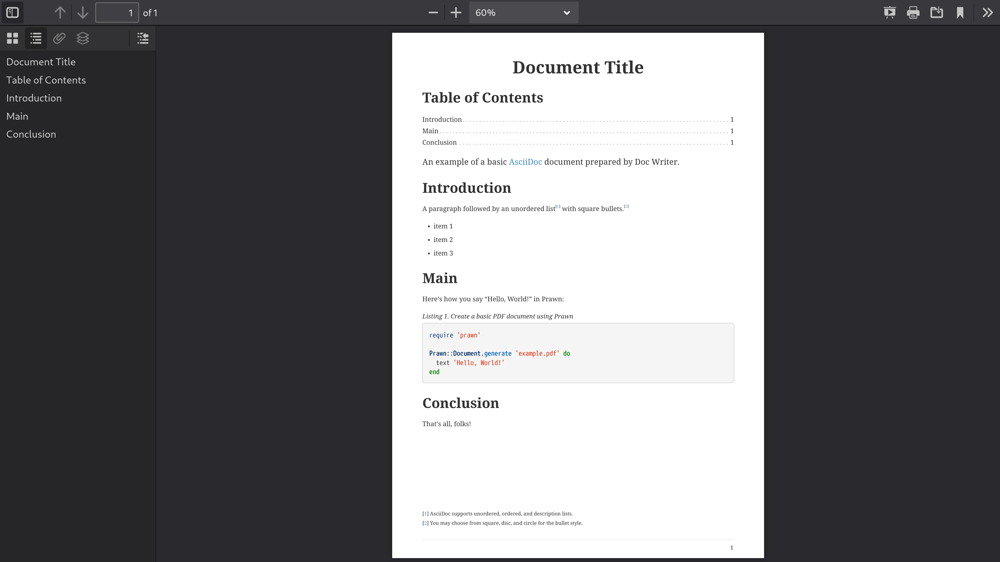

= Asciidoctor PDF 공식 문서
:source-highlighter: highlightjs
:toc:
:toclevels: 1

== What’s New

== Features

=== 하이라이트

- AsciiDoc에서 PDF로 직접 변환
- 기본 CSS와 유사한 구성 가능하고 구성 기반의 테마 시스템
- 테마 적용 가능한 AsciiDoc 블록 (예: example, admonition, sidebar 등)
- 사용자 정의 글꼴 (TTF 및 제한된 OTF 지원)
- 완전한 SVG 지원
- 표지 및 뒷표지 페이지
- 제목 페이지
- 문서 메타데이터 (제목, 저자, 주제, 키워드 등)
- PDF 문서 개요
- 페이지 번호가 있는 목차
- 구성 가능한 페이지 크기 (예: A4, Letter, Legal 등) 및 레이아웃 (세로 또는 가로)
- 내부 상호 참조 링크
- Rouge (선호), Pygments 또는 CodeRay를 사용한 구문 강조
- 구성 가능한 크기 조정이 가능한 페이지 배경색 또는 페이지 배경 이미지
- 페이지 번호 매기기
- 양면 (일명 프리프레스) 인쇄 모드 (즉, 마진이 본문 및 뒷면 페이지에서 교대로 표시됨)
- 사용자 정의 가능한 머리글 및 바닥글 실행 내용
- 섹션 본문 들여쓰기
- 분할 불가능한 블록
- 고아 섹션 제목 방지 (기본 지원)
- 자동 맞춤 verbatim 블록 (base_font_size_min 설정에 따라 허용됨)
- 표 테두리 설정
- 글꼴 기반 및 이미지 아이콘
- 자동 생성된 색인
- 자동 하이픈 (활성화된 경우)
- CJK 언어에 대한 관대한 줄 바꿈
- 출력 파일 압축 / 최적화

=== 알려진 제한 사항

- 모든 10진수 및 16진수 문자 참조가 지원됩니다 (예: ©). 그러나 변환기는 제한된 명명된 엔티티 집합만 처리합니다. 인식된 명명된 엔티티는 다음과 같습니다: amp, apos, gt, lt, nbsp 및 quot (예: ').
- PDF에서 원래 줄 바꿈을 유지하는 방식으로 텍스트를 복사하는 것은 특히 코드 블록에서 신뢰할 수 없습니다. 적절한 렌더링을 위해 보이지 않는 문자가 해석, 삽입 또는 삭제될 수 있습니다. 이는 주로 텍스트가 조각으로 분할되고 캔버스에서 절대 좌표에 배치되는 PDF 형식의 제한 사항입니다.
- 각주는 항상 미주로 표시됩니다 (책의 경우 장의 마지막 페이지 하단에, 다른 모든 문서 유형의 경우 문서의 마지막 페이지 하단에). PDF 생성기가 내용 재흐름을 지원하지 않기 때문에 각주를 현재 페이지 하단에 표시할 수 없습니다 (이유는 #85 참조).
- 단일 페이지 높이를 초과하는 표 셀은 경고와 함께 잘립니다 (prawn-table#41 참조).
  ** 이 제한 사항은 가로 dlist의 설명 블록에도 적용됩니다.
- 단일 페이지 높이를 초과하는 표의 rowspan은 고아가 되고 나머지 열이 잘립니다 (#403 참조).
- 열에 0% 너비 또는 단일 문자 너비보다 작은 너비를 할당할 수 없습니다. 이러한 경우가 발생하면 변환기는 표를 건너뛰고 경고를 내보냅니다.
- 표의 다른 모든 열의 너비가 100%를 충족하거나 초과하면 열을 자동 너비로 설정할 수 없습니다. 이러한 경우가 발생하면 변환기는 표를 건너뛰고 경고를 내보냅니다.
- 이미지 너비가 열 너비를 초과하면 표 셀의 인라인 이미지는 (열을 더 넓게 강제로 만드는 대신) 맞추기 위해 축소됩니다. cols를 사용하여 열 너비를 늘리거나 셀을 AsciiDoc 표 셀로 변환하고 가급적 블록 이미지를 사용할 수 있습니다 (#830 참조).
- 자동 너비 표 셀에서 백분율 너비 값을 가진 인라인 이미지는 고유 너비에 상대적으로 크기가 조정됩니다. 이미지를 위해 예약된 공간은 고유 너비와 일치합니다. 이는 HTML의 동작과 일치합니다.
- Prawn은 이중 너비 상자 그리기 글리프를 올바르게 지원하지 않으므로 verbatim 블록에서 상자 그리기가 제대로 정렬되지 않습니다 (prawn#1002 참조).
- 고아 및 과부 지원은 구분된 블록, 블록 이미지 및 admonition으로 제한됩니다. 따라서 - 섹션 제목과 첫 번째 내용 블록 사이에 페이지 나누기가 발생할 수 있습니다.
  ** 고아 섹션 제목을 피하려면 섹션에 breakable 옵션을 추가할 수 있습니다.
  ** 표에서 고아 캡션을 피하려면 표에 breakable 옵션을 추가하세요.
- 줄바꿈 방지 하이픈이 양쪽에 있는 서식 있는 텍스트로 둘러싸여 있거나 (또는 - 개별적으로 서식이 지정된 경우) 줄 바꿈을 방지하지 않습니다.
- 이미지의 float 속성 (즉, 이미지 플로트)은 인라인 이미지가 아닌 블록 이미지에만 지원됩니다. 변환기는 다음 비단락에서 또는 단락 내용이 이미지 하단을 지울 때 플로트를 지웁니다. 이미지 플로트 주위에 비단락 블록을 래핑하는 방법을 알아보려면 이미지 플로트 - 주위에 코드 블록 래핑을 참조하세요.
- 책 문서 유형에서는 여러 열이 지원되지 않습니다.
- 구문 강조를 사용하는 소스 블록에서는 인라인 HTML (예: 링크 또는 강조 텍스트)을 사용할 수 없습니다. 구문 강조기가 작동하는 방식 때문에 이러한 두 가지 기술은 PDF 생성 프로세스에서 혼합되지 않습니다.
- Verse 블록은 기본적으로 고정 폭 글꼴을 사용하지 않지만 테마를 사용하여 이 설정을 제어할 수 있습니다.
- 자동 ID가 있는 doctitle 또는 섹션 제목에서는 원격 인라인 이미지를 사용할 수 없습니다.
- source-highlighter가 설정된 경우 텍스트 서식 (예: subs=+quotes)을 도입하는 사용자 정의 subs를 소스 블록에 사용할 수 없습니다. 변환기는 구문 강조기에서 소스를 올바르게 인식하고 강조 표시할 수 있도록 자동으로 서식을 제거합니다.

== Install Asciidoctor PDF

이 페이지에서는 Asciidoctor PDF를 설치하는 방법을 배웁니다. 이 페이지에서는 필요한 전제 조건, Asciidoctor PDF를 설치하는 데 사용할 명령 및 추가 기능을 잠금 해제하기 위해 설치할 수 있는 선택적 종속성 카탈로그를 문서화합니다. 설치에 문제가 있는 경우 문제 해결 조언도 찾을 수 있습니다.

=== 전제 조건

Asciidoctor PDF는 Ruby 애플리케이션입니다. 따라서 실행하려면 Ruby 런타임이 필요합니다.

Asciidoctor PDF가 지원되고 테스트되는 Ruby 버전은 Ruby 2.7 이상 또는 JRuby 9.2 이상입니다. 가능하다면 항상 최신 버전의 Ruby 또는 JRuby를 사용하는 것이 좋습니다. 지원되지 않는 버전의 Ruby로 Asciidoctor PDF를 사용하려고 하면 변환이 예기치 않게 실패할 가능성이 높습니다.

Asciidoctor PDF를 설치할 때 다음 섹션에서 다룰 모든 필수 라이브러리(즉, 젬)가 자동으로 설치됩니다. 해당 선택적 기능을 활성화하려면 선택적 종속성을 직접 설치해야 합니다.

Ruby가 사용 가능한지 확인하려면 ruby 명령을 실행하여 설치된 버전을 인쇄합니다:

[source]
----
ruby -v
----

이 명령이 적어도 2.7로 시작하는 Ruby 버전(또는 적어도 9.2로 시작하는 JRuby 버전)을 보고하는지 확인하세요. 그렇다면 계속 진행할 준비가 된 것입니다. 그렇지 않은 경우 rvm.io로 이동하여 RVM을 받고 이를 사용하여 Ruby를 설치하세요.

==== 시스템 인코딩

Asciidoctor는 UTF-8 인코딩을 사용한다고 가정합니다. 인코딩 문제를 최소화하려면 시스템의 기본 인코딩이 UTF-8로 설정되어 있는지 확인하세요.

시스템 인코딩을 수정할 수 없는 경우 Asciidoctor를 사용할 때 기본 문자 인코딩을 재정의하는 방법을 알아보려면 시스템 인코딩 요구 사항 섹션을 참조하세요.

=== Asciidoctor PDF 설치

Asciidoctor PDF(gem: asciidoctor-pdf, command: asciidoctor-pdf)는 RubyGem으로 rubygems.org 소프트웨어 레지스트리에 게시됩니다. Ruby에서 제공하는 RubyGem 관리 도구(bundle 또는 gem)를 사용하여 해당 레지스트리에서 Asciidoctor PDF를 설치합니다. 또는 소스에서 Asciidoctor PDF를 빌드하고 설치할 수 있습니다.

Asciidoctor PDF를 설치하는 방법은 아래 표를 참조하세요. Gemfile에서 Bundler를 사용하여 젬을 관리하는 경우 Bundler 열에 나열된 항목을 추가하세요. 그렇지 않으면 gem 명령 열에 있는 명령을 실행하세요.

[%autowidth,cols="1,1,2,2"]
|===
|라이브러리 |gem 이름 |Bundler |gem 명령

|**Asciidoctor PDF**
|**asciidoctor-pdf**
|gem 'asciidoctor-pdf'
|gem install asciidoctor-pdf
|===

Asciidoctor PDF를 설치하면 이 문서에서 언급한 asciidoctor, prawn, prawn-svg, prawn-table, prawn-icon 및 ttfunk를 포함한 여러 추가 젬이 자동으로 설치됩니다. 이러한 필수 종속성의 버전은 Asciidoctor PDF 버전에 고정됩니다.

==== 사전 릴리스 또는 개발 버전 설치

RubyGems.org에서 asciidoctor-pdf 젬의 최신 사전 릴리스를 설치하려면(사전 릴리스가 있는 경우) 다음 명령을 사용하세요:

[source]
----
gem install asciidoctor-pdf --pre
----

개발 버전을 사용하거나 개발에 참여하려는 경우 소스에서 코드를 실행할 수도 있습니다.

=== 설치 문제 해결

아래와 같이 젬을 설치하는 동안 권한 오류가 발생하면 시스템에 직접 젬을 설치하려고 시도 중일 가능성이 높습니다. 기술 작성을 위해 시스템에 직접 젬을 설치하는 것은 권장되지 않습니다.

.시스템 젬으로 설치를 시도할 때 권한 오류 발생
[source]
----
ERROR:  While executing gem ... (Gem::FilePermissionError)
You don't have write permissions for the /Library/Ruby/Gems/2.x.x directory.
----

더 나은 방법(그리고 제정신을 유지할 수 있는 방법)은 시스템에 설치된 Ruby 버전을 무시하고 대신 RVM을 사용하여 Ruby 설치를 관리하는 것입니다. 이 접근 방식의 이점은 a) Ruby가 올바르게 설정되는 것이 보장되고, b) 젬 설치가 시스템 작동을 방해하지 않으며, c) 설치된 젬에서 제공하는 모든 bin 스크립트를 PATH에서 사용할 수 있다는 것입니다. 모든 파일은 사용자 공간(aka 홈 또는 사용자 디렉터리)에서 관리됩니다. 문제가 발생하면 $HOME/.rvm 폴더를 제거하고 다시 시작하면 됩니다.

RVM 설치 방법을 알아보려면 Asciidoctor 문서에서 다루는 RVM 설치 절차를 따르세요. RVM을 설치한 후 Ruby 버전을 설치하세요:

[source]
----
rvm install 3.1
----

그런 다음 해당 버전으로 전환하고 기본값으로 설정하세요:

[source]
----
rvm use 3.1 --default
----

Ruby 버전은 한 번만 설치하면 됩니다. 새 터미널을 열 때마다 기본 Ruby를 선택해야 합니다.

[source]
----
rvm use default
----

asciidoctor-pdf 젬을 설치한 후 다음 명령을 사용하여 설치된 위치를 확인할 수 있습니다:

[source]
----
gem which asciidoctor-pdf
----

bin 스크립트의 위치를 확인하려면 다음 명령을 사용하세요:

[source]
----
command -v asciidoctor-pdf
----

두 경로 모두 $HOME/.rvm 디렉터리 아래에 있어야 합니다. 그렇지 않은 경우 RVM 설정을 확인하세요.

=== 선택적 종속성

이 변환기에는 추가 젬 설치가 필요한 몇 가지 선택적 기능이 있습니다. 해당 기능은 다음과 같습니다.

_소스 강조 표시_::
소스 강조 표시를 사용하려면 구문 강조기를 설치해야 합니다(빌드 시에만).

_PDF 최적화_::

PDF를 최적화하려면 rghost 또는 hexapdf가 필요합니다. 설치 및 사용 지침은 PDF 최적화를 참조하세요.

_자동 하이픈 넣기_::

hyphens 속성을 사용하여 자동 하이픈 넣기를 켜려면 text-hyphen 젬을 설치해야 합니다:

[source]
----
gem install text-hyphen
----

_가속화된 이미지 디코딩_::

Ruby는 이미지 디코딩 속도가 특별히 빠르지 않으며 지원되는 이미지 형식이 제한적입니다. 이를 돕기 위해 prawn-gmagick을 설치할 수 있으며, 이는 이미지 디코딩 작업을 GraphicsMagick에 위임합니다. 이 통합을 활성화하는 방법에 대한 지침은 추가 이미지 파일 형식 지원을 참조하세요.

다음 표에는 이 변환기로 테스트된 Asciidoctor 확장을 포함하여 Asciidoctor PDF의 선택적 종속성이 나열되어 있습니다. 종속성 이름과 젬 이름이 최소 지원 버전과 함께 나열되며, 설치 시 활성화되는 기능이 나와 있습니다(필요한 경우).

.선택적 종속성의 최소 지원 버전
[%autowidth,cols="1,1,2"]
|===
|라이브러리 / 젬 이름 |최소 버전 |기능

|**Asciidoctor Mathematical** +
asciidoctor-mathematical
|0.3.5
|STEM 지원 (-r asciidoctor-mathematical 사용 필요)

|**Asciidoctor Diagram** +
asciidoctor-diagram
|2.2.0
|다이어그램 블록 (-r asciidoctor-diagram 사용 필요)

|**Asciidoctor Kroki** +
asciidoctor-kroki
|0.8.0
|다이어그램 블록 (-r asciidoctor-kroki 사용 필요)

|**Rouge** +
rouge
|2.0.0
|구문 강조 표시

|**Pygments (Ruby)** +
pygments.rb
|2.0.0
|구문 강조 표시

|**CodeRay** +
coderay
|1.1.0
|구문 강조 표시

|**Prawn Gmagick** +
prawn-gmagick
|0.0.9
|GraphicsMagick을 사용한 이미지 임베딩 가속화

|**RGhost** +
rghost
|0.9.7
(0.9.8 피하기)
|Ghostscript를 사용한 PDF 최적화 (optimize 속성 설정 필요)

|**Text Hyphen** +
text-hyphen
|1.4.1
|자동 하이픈 넣기 (hyphens 속성 설정 필요)
|===

== Upgrade to Asciidoctor PDF 2

이 가이드는 Asciidoctor PDF 1.x 릴리스에서 Asciidoctor PDF 2.x 릴리스로 전환하는 모든 사람을 위해 작성되었습니다. Asciidoctor PDF 2는 이 전환을 원활하게 만들기 위해 신중하게 설계되었지만, 여전히 주요 릴리스이므로 영향을 줄 수 있는 변경 사항이 있습니다. 또한 새롭고 개선된 기능을 활용하기 시작할 것입니다.

이 페이지는 Asciidoctor PDF 2 릴리스 라인의 모든 변경 사항에 주의를 기울이지 않습니다. 오히려 Asciidoctor PDF 1에서 Asciidoctor PDF 2로 전환할 때의 변경 사항에 중점을 둡니다. Asciidoctor PDF의 전체 변경 사항 목록을 찾으려면 CHANGELOG를 참조하세요.

=== 주요 변경 사항 및 제거

Asciidoctor PDF 2 주요 릴리스는 이 변환기의 일부 동작을 정리하고 개선할 수 있는 기회를 제공했습니다. 결과적으로 주요 변경 사항과 제거는 일반적입니다. 이 섹션에서는 전환을 돕기 위해 콘텐츠 및 구성에 영향을 줄 수 있는 변경 사항을 요약합니다.

==== 런타임 및 종속성

- Ruby < 2.7 및 JRuby < 9.2에 대한 지원이 제거되었습니다.
- 변환기는 이제 대문자, 소문자 및 대문자화 텍스트 변환을 위해 Ruby의 내장 멀티바이트 지원에 의존합니다. 추가 젬이 필요하지 않습니다.
- Asciidoctor PDF에서 더 이상 prawn-table 젬의 배포되지 않은 버전을 사용할 필요가 없습니다. 사용 중인 경우 Gemfile에서 해당 종속성을 제거하고 Asciidoctor PDF에서 prawn-table 젬에 대한 종속성을 처리하도록 하세요.
- safe_yaml 젬이 제거되었습니다. 대신 Ruby stdlib의 YAML.safe_load가 사용됩니다.

==== 테마 시스템 및 내장 글꼴

- pdf-style 및 pdf-stylesdir 속성에 대한 지원이 제거되었습니다(1.5.0.beta.1 이후 사용되지 않음). 대신 pdf-theme 및 pdf-themesdir 속성을 사용하여 사용자 정의 테마의 위치를 지정하세요.
- extends 키가 지정되지 않으면 사용자 정의 테마는 더 이상 기본 테마에서 상속되지 않습니다. 대신 키가 설정되지 않은 상태에서 시작하고(2.3.2 이후 base-font-size 시작) 필요할 때 변환기에서 폴백 값에 의존합니다. 업그레이드 후 오류가 발생하면 이것이 원인일 수 있습니다. 테마를 Asciidoctor PDF 버전에 이식 가능하게 만들려면 extends 키를 사용하여 테마가 확장할 테마를 명시적으로 선언하세요.
- 기본 테마를 사용하거나 기본 테마를 확장할 때 이제 기본 실행 바닥글이 활성화됩니다. (이전에는 기본 테마를 사용하거나 확장한 경우에만 기본 실행 바닥글이 활성화되었습니다.)
- 테마의 블록 및 프로즈 범주에 있는 top-margin 키가 제거되었습니다. 구분된 블록과 목록 사이의 공간은 이제 하단 여백만 사용하여 제어됩니다.
- 이전에 문서화되지 않은 vertical-spacing 키가 기본 제공 테마에서 제거되었습니다.
- 테마의 lead 범주 키는 lead라는 내장 역할로 대체되었습니다.
- 연계 및 테마 콘텐츠에서 <color> 태그에 대한 지원이 제거되었습니다. 대신 를 사용하세요. content 키의 값에 의사 HTML을 사용하는 테마에 영향을 줄 수 있습니다.
- 이전에 사용되지 않은 "ascii" 글꼴이 제거되었습니다. 이제 더 완전한 "subset" 글꼴만 젬과 함께 번들로 제공됩니다.

==== 문서 속성 및 옵션

- 사용되지 않은 chapter-label 문서 속성의 이름이 chapter-signifier 속성으로 변경되었습니다.
- untitled 섹션 옵션의 이름이 notitle 옵션으로 변경되었습니다.
- 이제 대부분의 블록은 기본적으로 분할 가능합니다. 블록에 unbreakable 옵션을 적용하여 이전 동작으로 되돌릴 수 있습니다.

==== 경로 및 API 요구

- asciidoctor-pdf/converter 및 asciidoctor-pdf/version shim 스크립트가 제거되었습니다. 대신 asciidoctor/pdf/converter 및 asciidoctor/pdf/version을 사용하세요.
- API의 Pdf 모듈 별칭이 PDF로 대체되어 제거되었습니다.

=== 사용 중단

다음 기능은 Asciidoctor PDF 2의 릴리스와 함께 사용이 중단되었으며 다음 주요 릴리스에서 제거될 예정입니다.

- 테마에서 blockquote 범주 접두사는 사용되지 않습니다. 대신 quote 접두사를 사용하세요. Quote Category Keys를 참조하세요.
- 테마에서 key 범주 접두사는 사용되지 않습니다. 대신 kbd 접두사를 사용하세요. Keyboard Macro Category Keys를 참조하세요.
- 테마에서 literal 범주 접두사는 사용되지 않습니다. 대신 codespan 접두사를 사용하세요. Codespan Category Keys를 참조하세요.
- 테마에서 outline-list 범주 접두사는 사용되지 않습니다. 대신 list 접두사를 사용하세요. List Category Keys를 참조하세요.
- Optimizer#generate_file 메서드는 사용되지 않습니다. 대신 Optimizer#optimize_file을 사용하세요.
- 내장 default-with-fallback-fonts 및 default-for-print-with-fallback-fonts 테마 이름은 각각 default-with-font-fallbacks 및 - default-for-print-with-font-fallbacks로 대체되어 사용되지 않습니다.

=== 새롭고 주목할 만한 기능

==== 단락 역할 및 들여쓰기

테마에서 사용자 정의 역할을 정의하고 문서의 특정 단락에 적용할 수 있습니다. 사용자 정의 역할을 만드는 방법을 알아보려면 Custom Roles를 참조하고, 사용자 정의 역할을 단락에 할당하는 방법은 Use a custom role을 참조하세요. 다른 블록에 사용자 정의 역할 적용은 아직 지원되지 않습니다. 그러나 확장 변환기 사용 사례 페이지에서 확장 변환기를 사용하여 이 기능을 활성화하는 방법을 알아볼 수 있습니다.

단락에 대한 역할 지원이 도입됨에 따라 테마의 lead 범주가 삭제되고 lead라는 내장 역할로 대체되었습니다. 자세한 내용은 Built-in roles를 참조하세요.

모든 단락 대신 내부 단락의 들여쓰기를 제어하려면 테마에서 새로운 prose-text-indent-inner 키를 설정할 수 있습니다. 자세한 내용은 Prose Category Keys를 참조하세요.

==== 분할 가능 및 분할 불가능한 블록

다음 블록은 이제 기본적으로 분할 가능하며, 자동 앵커 및 캡션 고아 방지가 포함됩니다:

- Admonitions
- Block images
- Code blocks (literal, listing, and source)
- Examples
- Open blocks
- Quote blocks
- Sidebars
- Verses

테이블과 섹션은 기본적으로 분할 가능하지만 자동 앵커 및 캡션 고아 방지를 제공하지 않습니다. 테이블의 경우 테이블이 다음 페이지로 넘어가면 앵커와 캡션이 현재 페이지에 남을 수 있습니다. 섹션의 경우 첫 번째 콘텐츠 블록이 맞지 않으면 섹션 제목이 현재 페이지에 남을 수 있습니다. 그러나 (겉보기에 불필요한) breakable 옵션을 힌트로 추가하면 테이블과 섹션에 대한 고아 방지를 켤 수 있습니다.

unbreakable 옵션은 섹션을 포함한 모든 구분된 블록(admonitions 및 테이블 포함)에 적용할 수 있지만 섹션에는 적용할 수 없습니다. unbreakable 옵션을 블록에 적용하면 블록이 페이지에 걸쳐 분할될 것으로 감지되고 한 페이지에 맞출 수 있는 경우 변환기가 블록과 캡션 및 앵커를 다음 페이지로 이동합니다.

==== Notitle 섹션 옵션

섹션의 untitled 옵션 이름이 notitle로 변경되었습니다. 이름이 변경되면서 새로운 기능도 얻었습니다. notitle 옵션은 문서 본문에서 섹션 제목을 숨기지만 TOC에 제목을 표시하고 해당 제목에서 생성된 앵커를 계속 참조할 수 있도록 합니다. 또한 서문, 익명 머리말 및 가져온 PDF 페이지에 대한 항목을 TOC에 추가하는 데 사용할 수 있습니다. 예제와 자세한 내용은 Hide Section Titles를 참조하세요.

==== 블록 및 블록 캡션

블록과 블록 캡션은 Asciidoctor PDF 2에서 많은 새로운 테마 기능을 얻었습니다. 다음은 몇 가지 주요 사항입니다:

패딩::
테마는 이제 2개의 값 배열을 사용하여 블록의 패딩을 제어할 수 있습니다.

테두리 너비::
구분된 블록, admonitions 및 블록 이미지의 테두리 너비는 border-width 키를 사용하여 가장자리별로 사용자 정의할 수 있습니다.

테두리 스타일::
구분된 블록, admonitions 및 블록 이미지의 테두리 스타일은 border-style 키로 변경할 수 있습니다. 테두리 스타일에는 dashed, dotted, double 및 solid가 포함됩니다.

줄 높이::
테마에서 글꼴 속성이 허용되는 곳이면 어디에서나 line-height 키를 사용하여 블록의 줄 높이를 제어할 수 있습니다.

앵커 위치::
블록의 앵커 위치는 block-anchor-top 테마 키를 사용하여 콘텐츠를 기준으로 상대적으로 배치할 수 있습니다.

캡션 텍스트 정렬::
캡션의 텍스트 정렬은 이제 전역 caption-text-align 테마 키 또는 블록 범주별 <category>-caption-text-align을 사용하여 블록 정렬과 독립적으로 제어할 수 있습니다. image-caption-text-align 및 table-caption-text-align 테마 키는 표준 텍스트 정렬 값 외에도 inherit 값을 허용합니다. inherit 값은 블록 이미지 또는 테이블의 정렬로 해석됩니다.

전역 캡션 텍스트 장식::
캡션에 텍스트 장식 스타일, 색상 및 너비를 caption-text-decoration-style, caption-text-decoration-color 및 caption-text-decoration-width 테마 키를 사용하여 전역적으로 적용할 수 있습니다. 자세한 내용은 Caption Category Keys를 참조하세요.

캡션 배경색::
캡션의 배경색은 이제 caption-background-color 테마 키 또는 블록 범주별 <category>-caption-background-color를 사용하여 전역적으로 지정할 수 있습니다. 자세한 내용은 Caption Category Keys를 참조하세요.

캡션 최대 너비::
캡션의 max-width 값은 fit-content 함수에 백분율을 인수로 전달하여 콘텐츠의 백분율로 설정할 수 있습니다.

초록의 첫 번째 줄::
테마는 abstract-first-line-font-color 키를 사용하여 초록의 첫 번째 줄의 글꼴 색상을 제어할 수 있습니다.

블록의 주목할 만한 수정 사항::
- Asciidoctor PDF는 이제 더 스마트한 하단 여백 로직을 사용하여 블록 아래에 추가 공백이 추가되는 것을 방지합니다. 특히 블록이 중첩되거나 AsciiDoc 테이블 셀 내에서 사용되는 경우에 효과적입니다.
- specialchars 치환이 비활성화된 경우 구문 강조가 소스 블록에 적용되지 않습니다.
- 테두리, 음영 및 패딩은 축소 가능한 블록에 적용되지 않습니다.
- callouts 치환은 코드 블록에서 제거할 수 있습니다.

==== 테이블

테두리 너비 및 스타일::
테이블 테두리 너비는 border-width 키를 사용하여 가장자리별로 사용자 정의할 수 있습니다. 테두리 스타일은 border-style 키에 스타일 배열을 할당하여 가장자리별로 지정할 수 있습니다. 테두리 스타일에는 dashed, dotted 및 solid가 포함됩니다.

그리드 너비 및 스타일::
테이블 그리드 선의 너비는 grid-width 키를 사용하여 행과 열에 대해 지정할 수 있습니다. 그리드 선의 스타일은 grid-style 키를 사용하여 행과 열에 대해 지정할 수 있습니다. 그리드 스타일에는 dashed, dotted 및 solid가 포함됩니다.

최대 캡션 너비::
테이블의 최대 캡션 너비는 fit-content 함수에 인수를 전달하여 콘텐츠의 백분율로 설정할 수 있습니다.

캡션 끝::
table-caption-side 테마 키의 이름이 table-caption-end로 변경되었습니다.

테이블의 주목할 만한 수정 사항::
- 일반 테이블 셀에 수직 중앙 정렬이 올바르게 적용됩니다.
- frame과 grid가 none일 때 테이블 행의 하단 테두리가 올바르게 적용됩니다.
- 리터럴 테이블 셀 및 AsciiDoc 테이블 셀의 중첩된 블록의 글꼴 크기가 이제 조정됩니다.
- AsciiDoc 테이블 셀은 테이블에서 글꼴 속성을 상속합니다.
- AsciiDoc 테이블 셀의 내용이 바닥글이나 후속 페이지를 넘어가지 않도록 방지됩니다.
- 상단 및 하단 패딩은 AsciiDoc 테이블 셀의 높이를 계산할 때 고려됩니다.
- 테이블 셀이 잘린 경우 오류 메시지가 기록됩니다.
- 오류를 발생시키는 대신 콘텐츠가 셀의 지정된 너비 내에 맞지 않으면 변환기가 오류를 기록하고 테이블을 건너뜁니다.

==== 콜아웃 목록 및 번호

테마 언어에는 이제 callout-list 범주가 있습니다. 새로운 테마 키를 사용하면 콜아웃 목록의 글꼴 속성, 텍스트 정렬 및 항목 간격을 사용자 정의할 수 있습니다. callout-list 범주에는 코드 블록 바로 다음에 오는 콜아웃 목록의 상단 여백을 제어할 수 있는 margin-top-after-code 키가 포함되어 있습니다.

_콜아웃의 주목할 만한 수정 사항_::
- 항목이 다음 페이지로 이동할 때 콜아웃 목록의 콜아웃 번호는 기본 텍스트와 함께 유지됩니다.
- 코드 블록에서 공백으로 구분된 2개 이상의 연속된 콜아웃이 올바르게 처리됩니다.
- 테마에서 conums에 할당된 글꼴 패밀리가 코드 블록에 표시되는 콜아웃 번호에 적용됩니다.

==== 이미지 및 아이콘

_캡션 끝_::
block-caption-end 테마 키를 사용하여 블록 이미지의 캡션을 이미지 위 또는 아래에 배치할 수 있습니다. 사용 가능한 image-caption 테마 키 및 해당 값 유형 목록은 Block Image Category Keys를 참조하세요.

_텍스트 정렬 역할_::
text-center와 같은 텍스트 정렬 역할이 이제 블록 이미지에서 지원됩니다.

_인라인 이미지의 역할_::
역할 및 상속된 역할이 이제 인라인 이미지에서 지원됩니다.

_이미지 기반 아이콘_::
Asciidoctor PDF 2는 이제 이미지 기반 아이콘을 지원합니다. iconsdir에서 확인되며 icontype 파일 확장자를 가져야 합니다.

_아이콘에 링크 추가_::
link 속성을 이제 아이콘 매크로에 설정할 수 있습니다.

_Admonition 아이콘 이미지_::
admonition 아이콘 이미지는 이제 allow-uri-read가 설정된 경우 원격일 수 있으며 데이터 URI일 수도 있습니다.

_이미지 및 아이콘의 주목할 만한 수정 사항_::
- 이제 백그라운드 SVG의 경고가 로거에 전달됩니다.
- fit=scale-down을 사용할 때 SVG가 올바르게 축소됩니다.
- 아이콘 이미지를 포함하지 못하면 admonition의 텍스트 레이블이 표시됩니다.

==== 링크 및 인라인 서식

인용 부호::
이제 ›와 »와 같은 작은따옴표와 큰따옴표를 테마의 quotes 키를 사용하여 정의할 수 있습니다. 자세한 내용은 Quotes Category Keys를 참조하세요.

16진수 문자::
대문자와 소문자 16진수 문자를 모두 포함하는 문자 참조가 이제 지원됩니다.

링크의 배경색 및 테두리 오프셋::
이제 테마에서 링크의 배경색과 테두리 오프셋(배경에 대해서만)을 제어할 수 있습니다.

주목할 만한 링크 및 인라인 서식 수정 사항::
- 줄임표가 뒤에 오는 닫는 따옴표는 인용 부호로 묶인 텍스트와 함께 유지됩니다.
- 상위 요소가 em 및 % 단위를 사용하는 경우 위 첨자 및 아래 첨자의 글꼴 크기가 올바르게 계산됩니다.
- 단어가 단어가 아닌 문자에 인접해 있을 때 하이픈 예외가 적용됩니다.
- pre-wrap 역할은 구문에서 적용됩니다.
- id 속성을 이제 링크 매크로에 설정할 수 있습니다.

==== 글꼴, 글꼴 스타일 및 텍스트 변환

작은 대문자::
text-transform 테마 키는 이제 smallcaps 값을 허용합니다. smallcaps가 지정되면 소문자 ASCII 문자(a-z)가 해당 작은 대문자 문자 변형으로 대체됩니다.

normal_italic::
font-style 키의 새로운 normal_italic 값은 글꼴 스타일을 normal로 재설정한 다음 글꼴 패밀리의 이탤릭체 변형을 적용합니다.

Noto Sans::
Noto Sans는 이제 Asciidoctor PDF와 함께 제공됩니다. sans-with-fallback-font 테마에서 대체 글꼴로 사용되며 사용자 정의 테마에서 선언할 수 있습니다.

천장 및 바닥 문자::
왼쪽 및 오른쪽 천장 및 바닥 문자(⌈, ⌉, ⌊ 및 ⌋)가 M+ 대체 글꼴에 추가되었습니다.

체크 표시, numero 및 y with diaeresis 글리프::
굵은 체크 표시 글리프(✔)가 대체 글꼴에 추가되었습니다. 체크 표시와 굵은 체크 표시(✓ 및 ✔)가 고정폭 글꼴에 추가되었습니다. № 및 ÿ 글리프가 기본 및 대체 글꼴에 추가되었습니다.

==== 표지 및 제목 페이지

앞표지 및 뒤표지 이미지::
앞표지 및 뒤표지 이미지는 이제 테마에서 정의할 수 있으며 대상은 데이터 URI일 수 있습니다.

제목 페이지 비활성화::
제목 페이지는 이제 title-page 범주 키에 false를 할당하여 테마에서 비활성화할 수 있습니다.

==== TOC 및 PDF 개요

_PDF 개요 제목 및 수준_::
이제 outline 문서 속성(:!outline:)을 설정 해제하여 PDF 개요를 비활성화할 수 있습니다. 또한 outline-title로 제목을 사용자 정의하고 outlinelevels로 섹션 수준 깊이 및 확장을 사용자 정의할 수 있습니다. 자세한 내용은 PDF Outline을 참조하세요.

_TOC 페이지에서 실행 중인 콘텐츠 비활성화_::
toc 매크로에 noheader 또는 nofooter 옵션을 할당하여 TOC 페이지에서 머리글이나 바닥글을 비활성화할 수 있습니다.

_TOC 점선_::
테마는 TOC의 점선 글꼴 크기를 제어할 수 있습니다.

_TOC 위치_::
TOC는 이제 :toc: 문서 속성에 preamble 값을 할당하여 서문 뒤에 배치할 수 있습니다. 또한 TOC는 toc 매크로의 첫 번째 위치에만 표시됩니다.

_확장 변환기_::
확장 변환기는 이제 TOC 항목을 삽입하거나 필터링하기 위해 get_entries_for_toc 메서드를 재정의할 수 있습니다.

_TOC의 주목할 만한 수정 사항_::
이제 이미지가 해당 TOC 항목의 섹션 제목 끝에 렌더링됩니다.

==== 각주

_번호 재설정_::
각주 번호 매기기는 이제 각 장에서 재설정됩니다.

_각주 참조 레이블_::
장의 xreftext는 이제 이전 장을 참조하는 각주 참조의 레이블에 추가됩니다.

_해결되지 않은 각주 색상_::
테마는 unresolved 역할을 사용하여 해결되지 않은 각주의 글꼴 색상을 구성할 수 있습니다.

_각주의 주목할 만한 수정 사항_::
- 누락된 각주 참조는 위 첨자로 표시됩니다.
- AsciiDoc 테이블 셀에 정의된 각주는 이제 문서 또는 장 끝에 있는 각주와 함께 렌더링됩니다.

==== 색인

_색인 열_::
테마는 이제 index-columns 키를 사용하여 색인 열 수를 구성할 수 있습니다.

_페이지 번호 스타일_::
media=screen일 때 새로운 index-pagenum-sequence-style 문서 속성이 색인의 순차적 페이지 번호 스타일을 제어합니다.

_색인의 주목할 만한 수정 사항_::
- 색인 항목이 없으면 색인 섹션이 렌더링되지 않습니다.
- 용어가 강제로 분리될 때 색인에 더 이상 빈 줄이 삽입되지 않습니다.
- 색인의 후속 페이지에서 프리프레스 페이지 여백이 적용됩니다.
- 숨겨진 색인 용어 앞의 공백이 이제 축소됩니다.

==== 실행 콘텐츠 및 페이지 번호 매기기

_실행 콘텐츠가 시작되는 페이지 선택_::
running-content 범주의 start-at 테마 키에 정수를 할당하여 실행 콘텐츠가 표시되기 시작하는 페이지를 지정합니다. 실행 콘텐츠는 TOC가 배치된 위치에 관계없이 TOC 다음에 after-toc 키워드를 start-at 키에 할당하여 시작할 수도 있습니다.

_정수 페이지 번호 매기기가 시작되는 위치 구성_::
page-numbering 범주의 start-at 키를 사용하여 정수(1부터 시작) 페이지 번호 매기기가 시작되는 페이지를 지정합니다. cover 키워드를 start-at 키에 할당하여 정수 페이지 번호 매기기가 앞표지에서 시작할 수 있습니다. 또는 TOC가 배치된 위치에 관계없이 after-toc를 start-at 키에 할당하여 페이지 번호 매기기가 TOC 다음에 시작되도록 할 수 있습니다. 또는 start-at에 정수가 할당된 경우 페이지 번호 매기기가 시작되어야 하는 첫 번째 본문 페이지에서의 오프셋을 테마에서 지정할 수 있습니다.

_여백 및 콘텐츠 여백_::
이제 테마에서 주변 장치(머리글 또는 바닥글) 및 면(앞면 또는 뒷면)별로 실행 콘텐츠의 여백과 콘텐츠 여백을 구성할 수 있습니다. 실행 콘텐츠의 여백은 끝과 면에 대해 2개의 값 배열 또는 암시적 왼쪽 면 값이 있는 3개의 값 배열을 사용하여 지정할 수 있습니다.

_부분 및 장 번호_::
partnums 속성이 설정되면 part-numeral 속성이 실행 콘텐츠에 자동으로 설정됩니다. sectnums 속성이 설정되면 chapter-numeral 속성이 실행 콘텐츠에 자동으로 설정됩니다.

_레이아웃별 배경 선택_::
page-layout 속성이 이제 실행 콘텐츠에 설정됩니다. 이 속성을 사용하여 레이아웃별로 배경을 선택할 수 있습니다.

_실행 콘텐츠 및 페이지 번호 매기기의 주목할 만한 수정 사항_::
- media=prepress일 때도 pdf-folio-placement 설정이 적용됩니다.
- 프리프레스 페이지 여백은 pdf-folio-placement 값을 적용합니다.

==== 테마 시스템

_인쇄에 최적화된 테마_::
Asciidoctor PDF 2는 default-for-print 및 default-for-print-with-fallback-font라는 두 개의 새로운 인쇄에 최적화된 테마를 도입합니다.

_확장 계층 구조_::
Asciidoctor PDF는 !important로 수정되지 않는 한 extends 계층 구조에서 테마를 한 번만 확장합니다.

_거듭제곱 연산자_::
이제 테마 언어에서 거듭제곱 연산자를 지원합니다. 곱하기 및 나누기와 동일한 우선순위를 가집니다.

_기본 테마 변경 사항_::
기본 테마에서 인용 및 verse 블록의 상단 및 하단 패딩이 줄어들었습니다. base-border-color가 이제 설정되어 기본 테두리 색상으로 사용됩니다. 테마를 확장할 때 base-border-color 키를 사용하여 모든 테두리 색상을 제어할 수 있도록 기본 테마에서 테두리 색상이 제거되었습니다.

_기본 테마 변경 사항_::
기본 테마에서 인용 블록의 상단 및 하단 패딩이 이제 균일합니다.

_Rouge 테마_::
Rouge 테마는 이제 테마 클래스 또는 인스턴스(API에만 해당)로 지정할 수 있습니다.

== Convert AsciiDoc to PDF

=== Asciidoctor PDF 실행하기

필요한 모든 젬이 제대로 설치되었다고 가정하면, asciidoctor-pdf 명령을 실행할 수 있는지 확인하세요:

[source]
----
asciidoctor-pdf -v
----

Asciidoctor PDF 버전이 출력되면 Asciidoctor PDF를 사용할 준비가 된 것입니다!
증류할 AsciiDoc 문서를 가져와서 Asciidoctor PDF를 사용해 보겠습니다. AsciiDoc 문서가 없다면 Basic Example AsciiDoc 파일을 다운로드하여 사용할 수 있습니다. 파일을 현재 디렉터리에 저장하세요.

해당 파일의 내용을 살펴보겠습니다.

.basic-example.adoc
[source,asciidoc]
----
= Document Title
Doc Writer <doc@example.com>
:reproducible:
:listing-caption: Listing
:source-highlighter: rouge
:toc:
// Uncomment next line to add a title page (or set doctype to book)
//:title-page:
// Uncomment next line to set page size (default is A4)
//:pdf-page-size: Letter

An example of a basic https://asciidoc.org[AsciiDoc] document prepared by {author}.

== Introduction

A paragraph followed by an unordered list{empty}footnote:[AsciiDoc supports unordered, ordered, and description lists.] with square bullets.footnote:[You may choose from square, disc, and circle for the bullet style.]

[square]
* item 1
* item 2
* item 3

== Main

Here's how you say "`Hello, World!`" in Prawn:

.Create a basic PDF document using Prawn
[source,ruby]
----
require 'prawn'

Prawn::Document.generate 'example.pdf' do
  text 'Hello, World!'
end
----

== Conclusion

That's all, folks!
----

이제 AsciiDoc 문서를 직접 PDF로 변환할 시간입니다.

=== AsciiDoc 문서를 PDF로 변환하기

[IMPORTANT]
====
이 예제를 실행하려면 source-highlighter 속성에 rouge 값을 사용하므로 rouge 젬이 설치되어 있어야 합니다.
====

PDF로 변환하는 것은 Ruby를 사용하여 asciidoctor-pdf 명령을 실행하고 첫 번째 인수로 AsciiDoc 문서를 전달하는 것만큼 간단합니다:

[source]
----
asciidoctor-pdf basic-example.adoc
----

이 명령은 PDF 변환기와 백엔드를 활성화하여 asciidoctor를 실행하는 더 짧은 방법입니다:

[source]
----
asciidoctor -r asciidoctor-pdf -b pdf basic-example.adoc
----

asciidoctor-pdf 명령은 이러한 낮은 수준의 옵션을 기억할 필요가 없어 편리합니다. 그래서 우리는 이 명령을 제공합니다.

명령이 완료되면 현재 디렉터리에 basic-example.pdf 파일이 보일 것입니다. 기본적으로 Asciidoctor는 입력 파일과 동일한 디렉터리에 출력 파일을 생성합니다. PDF 뷰어로 basic-example.pdf 파일을 열어 결과를 확인하세요.

.Example PDF document rendered in a PDF viewer

문서의 본문이 단일 열로 배열되어 있음을 알 수 있습니다. 문서 유형이 article(기본값) 또는 manpage로 설정된 경우 사용자 정의 테마의 page-columns 키에 열 수를 할당하여 문서 본문을 여러 열로 정렬할 수 있습니다. 열 사이의 간격 너비는 page-column-gap 테마 키를 사용하여 조정할 수 있습니다. 이 기능을 활성화하는 방법에 대한 자세한 내용은 Page Columns를 참조하세요.

=== API를 사용하여 PDF로 변환하기

asciidoctor-pdf 명령 외에도 Asciidoctor API를 사용하여 PDF로 변환할 수 있습니다. Asciidoctor PDF 변환기의 선택은 API 옵션 또는 문서 속성으로 지정할 수 있는 backend 키워드 사용을 통해 제어됩니다.

먼저 Asciidoctor PDF 젬이 설치되어 있고 Ruby 런타임 경로에서 사용 가능한지 확인하세요. 해당 단계가 완료되면 asciidoctor-pdf 젬을 요청하여 Asciidoctor PDF 변환기를 로드하세요.

[source,ruby]
----
require 'asciidoctor-pdf'
----

이제 기본 Asciidoctor API를 사용하여 AsciiDoc 문서를 PDF로 변환할 수 있습니다.

[source,ruby]
----
require 'asciidoctor-pdf'

Asciidoctor.convert_file 'basic-example.adoc', backend: 'pdf', safe: :unsafe
----

이 API 호출은 이전 섹션에 표시된 명령과 동일합니다. 스크립트는 먼저 asciidoctor-pdf 젬을 요청합니다(-r asciidoctor-pdf와 동일함). 그런 다음 안전 모드를 unsafe로 설정하고(asciidoctor 명령과 동일함) 백엔드를 pdf로 설정하여(-b pdf와 동일함) Asciidoctor를 호출합니다. ruby 명령을 사용하여 이 스크립트를 실행할 수 있습니다.

스크립트가 완료되면 현재 디렉터리에 basic-example.pdf 파일이 보일 것입니다. 이 파일이 작성되는 위치를 사용자 정의하려면 일반적인 API 옵션 집합을 사용할 수 있습니다.

convert_file 메서드 대신 convert 메서드를 사용하면 Asciidoctor는 변환기의 인스턴스(Prawn::Document의 인스턴스이기도 함)를 반환합니다. PDF 스트림을 캡처하려면 출력을 StringIO 객체로 리디렉션하여 수행해야 합니다.

[source,ruby]
----
require 'asciidoctor-pdf'
require 'stringio'

doc = Asciidoctor.convert 'I *love* AsciiDoc!', backend: 'pdf', safe: :unsafe
doc.write doc, (pdf = StringIO.new)
puts pdf.string
----

반환된 문서를 동일한 객체의 write 메서드에 전달하여 PDF 스트림을 나중에 캡처할 수도 있습니다.

[source,ruby]
----
require 'asciidoctor-pdf'
require 'stringio'
doc = Asciidoctor.convert 'I love AsciiDoc!', backend: 'pdf', safe: :unsafe
doc.write doc, (pdf = StringIO.new)
puts pdf.string
----

이 호출은 다음과 동일합니다:
[source,ruby]
----
require 'asciidoctor-pdf'
require 'stringio'

puts (Asciidoctor.convert 'I *love* AsciiDoc!', backend: 'pdf', safe: :unsafe).render
----

주요 차이점은 반환된 변환기 객체에서 render를 직접 호출하면 정리 루틴이 트리거되지 않는다는 것입니다. 이는 PDF로 변환할 때 중요합니다. 따라서 StringIO 객체를 대상으로 사용하는 것이 좋습니다.

== Images

== Images - Image Paths and Formats

=== 이미지 해상도

이미지는 변환기가 실행될 때 해결됩니다. 즉, 변환기가 이미지를 찾을 수 있는 위치에 있어야 하며 변환기가 읽을 수 있는 형식이어야 합니다.

==== imagesdir 속성

문서의 상대 이미지 경로는 imagesdir 속성의 값에 상대적으로 해석됩니다. 이는 data-uri 속성이 설정된 경우 내장 HTML 변환기의 작동 방식과 효과적으로 동일합니다. imagesdir은 기본적으로 비어 있으며, 이는 상대 이미지 경로가 입력 문서에 상대적으로 해석됨을 의미합니다. 테마의 상대 이미지 경로는 pdf-themesdir 속성의 값에 상대적으로 해석됩니다(기본값은 테마 파일의 디렉터리). imagesdir 속성은 테마 파일의 이미지 경로를 해석할 때 사용되지 않습니다. 절대 이미지 경로는 그대로 사용됩니다.

이미지가 SVG이고 SVG에 상대 경로를 가진 중첩된 래스터 이미지(PNG 또는 JPG)가 포함된 경우, 해당 경로는 SVG를 포함하는 디렉터리에 상대적으로 해석됩니다.

allow-uri-read 속성이 CLI 또는 API를 통해 활성화되지 않는 한 변환기는 대상이 URI인 경우(SVG의 이미지 참조 포함) 이미지 포함을 거부합니다.

SVG에서 연결된 이미지를 사용하는 경우 해당 이미지의 너비와 높이를 지정해야 합니다. 그렇지 않으면 SVG 라이브러리가 이를 처리하지 못합니다.

==== Asciidoctor Diagram 통합

Asciidoctor PDF는 Asciidoctor Diagram과 원활한 통합을 제공합니다.

이 통합은 Asciidoctor PDF가 내부적으로 data-uri 문서 속성을 설정하기 때문에 작동합니다. Asciidoctor Diagram이 이 속성이 설정되었음을 감지하면 생성된 이미지의 절대 경로를 전달하여 Asciidoctor PDF가 이를 찾을 수 있도록 합니다. 생성된 이미지가 중간 단계로 파일에 기록되지만 Asciidoctor PDF는 여전히 해당 이미지를 생성된 문서에 포함합니다. 따라서 이 동작은 data-uri 속성의 정의와 일치합니다.

Asciidoctor PDF에서 Asciidoctor Diagram을 사용할 때 입력 디렉터리(docdir)와 출력 디렉터리(outdir 및 차례로 imagesoutdir)가 다를 수 있으며 Asciidoctor PDF는 여전히 생성된 이미지를 찾아 포함할 수 있습니다.

Asciidoctor Diagram은 내재된 outdir 속성에서 imagesoutdir을 구축합니다. 이는 Asciidoctor PDF가 출력을 파일에 쓰는 경우에 작동합니다. 출력이 파일에 기록되지 않는 경우 outdir 또는 imagesoutdir 속성을 명시적으로 설정할 수 있습니다.

다이어그램 블록 또는 매크로의 pdfwidth 속성을 사용하여 PDF의 이미지 표시 크기를 변경할 수 있습니다.

==== 이미지 형식

다음 이미지 유형(및 해당 파일 확장자)이 지원됩니다:

- PNG (.png)
- JPEG (.jpg)
- SVG (.svg)

[CAUTION]
====
prawn-gmagick을 설치하지 않는 한 GIF (.gif), TIFF (.tiff), WebP (.webp), BMP (.bmp) 및 인터레이스 PNG 형식은 지원되지 않습니다. 자세한 내용은 추가 이미지 파일 형식에 대한 지원을 참조하세요.
====

[NOTE]
====
SVG는 루트 <svg> 요소에 viewBox 속성을 선언해야 합니다. 해당 정보가 없으면 변환기는 SVG 데이터를 올바르게 해석하는 방법을 알 수 없으며 이미지의 일부가 잘릴 수 있습니다. 루트 <svg> 요소에 width와 height 속성을 정의하지 않도록 합니다. (width를 100%로 설정하면 가시적 이미지 위아래에 빈 공간이 추가될 수 있어 특히 문제가 됩니다.) 너비는 대신 이미지 매크로의 pdfwidth 속성을 사용하여 제어해야 합니다.
====

이미지를 PDF에 포함하려면 Asciidoctor PDF가 이를 디코딩하는 방법을 이해해야 합니다. 이 작업을 수행하기 위해 Asciidoctor는 기본 라이브러리에 위임합니다. Prawn은 JPG 및 PNG 이미지 디코딩을 지원합니다. prawn-svg는 SVG 이미지를 PDF 명령으로 변환하는 기능을 제공합니다. 추가 라이브러리 없이는 Asciidoctor PDF에서 지원하는 유일한 이미지 파일 형식입니다.

==== 추가 이미지 파일 형식에 대한 지원

GIF, TIFF, WebP 또는 인터레이스 PNG와 같은 추가 이미지 형식에 대한 지원이 필요하고 해당 이미지를 JPG와 같은 지원되는 형식으로 변환하고 싶지 않은 경우 prawn-gmagick Ruby 젬을 설치해야 합니다. prawn-gmagick은 GraphicsMagick에 이미지 디코딩을 위임하여 해당 라이브러리에서 인식하는 모든 이미지 형식에 대한 지원을 추가하는 Prawn용 확장(Linux 및 macOS에서만 사용 가능)입니다.

prawn-gmagick은 PNG 이미지를 많이 포함하는 PDF 생성에 필요한 처리 시간, 전력 및 메모리를 크게 줄이는 추가 이점이 있습니다. Pro Git과 같은 큰 책의 경우 변환 시간이 최대 절반 정도 줄어드는 것을 볼 수 있습니다. PNG 이미지 데이터의 압축 해제(특히 zlib 팽창)에는 많은 수학적 계산이 필요하며, Ruby는 이를 수행하는 데 특별히 효율적이지 않습니다. 그래서 prawn-gmagick 젬을 변환기에 추가하면 그렇게 큰 차이를 만듭니다.

prawn-gmagick을 사용하는 대신 Asciidoctor PDF에 전달하는 이미지를 축소하거나 JPG와 같은 압축되지 않은 형식으로 변환하여 최적화할 수 있습니다.

prawn-gmagick 젬은 네이티브 확장을 사용하여 GraphicsMagick에 대해 컴파일합니다. 이 시스템 전제 조건은 Linux 및 macOS에서 실행되는 C Ruby로 설치를 제한합니다. 설치 방법을 알아보려면 prawn-gmagick의 README를 참조하세요.

[source]
----
gem install prawn-gmagick
----

이 젬이 설치되면 Asciidoctor가 자동으로 감지하고 로드한 다음 제공하는 브리지를 통해 모든 이미지 디코딩을 GraphicsMagick에 위임합니다. 설치할 수 있다면 Asciidoctor PDF에서 이 젬을 사용하는 것이 좋습니다.

==== prawn-gmagick 등록 취소

드문 경우지만 GraphicsMagick(prawn-gmagick의 백엔드 라이브러리)는 특정 PNG 이미지의 비트 깊이를 잘못 읽을 수 있습니다. 이런 일이 발생하면 Asciidoctor PDF에 GraphicsMagick에 위임하지 않도록 지시할 수 있습니다.

Asciidoctor PDF를 호출할 때 asciidoctor/pdf/nopngmagick을 요구하여 PNG 이미지를 로드할 때 Asciidoctor PDF가 GraphicsMagick에 위임하지 않도록 구성할 수 있습니다.

[source]
----
asciidoctor-pdf -r asciidoctor/pdf/nopngmagick doc.adoc
----

또는 Asciidoctor PDF를 호출할 때 asciidoctor/pdf/nogmagick을 요구하여 Asciidoctor PDF에 GraphicsMagick에 전혀 위임하지 않도록 지시할 수 있습니다.

[source]
----
asciidoctor-pdf -r asciidoctor/pdf/nogmagick doc.adoc
----

prawn-gmagick을 우회하면 Prawn이 처리할 수 없는 추가 이미지 형식에 대한 지원과 제공하는 PNG 가속이 더 이상 제공되지 않습니다.

==== SVG 이미지의 글꼴

Asciidoctor PDF는 prawn-svg를 사용하여 Asciidoctor Diagram에서 생성된 SVG를 포함하여 SVG를 PDF 문서에 포함합니다.

실제로 prawn-svg가 SVG를 포함한다고 말하는 것은 정확하지 않습니다. 오히려 prawn-svg는 SVG 렌더러입니다. prawn-svg는 SVG를 기본 PDF 텍스트 및 그래픽 객체로 변환합니다. SVG를 일련의 그리기 명령으로 생각할 수 있습니다. 결과는 다른 PDF 객체와 구별할 수 없게 됩니다.

텍스트의 경우 SVG에서 텍스트에 사용되는 모든 글꼴 패밀리가 Asciidoctor PDF 테마 파일(및 Prawn)에 등록되어야 한다는 것을 의미합니다. 그렇지 않으면 Prawn은 PDF의 내장(afm) 글꼴 중 가장 일치하는 글꼴(예: sans-serif는 Helvetica가 됨)을 사용하게 됩니다. afm 글꼴은 기본 라틴어만 지원한다는 점을 기억하세요. 우리가 말하듯이 PDF는 자신의 글꼴을 가져와야 합니다.

Asciidoctor Diagram을 사용하여 PDF에 포함할 SVG를 생성하는 경우 다이어그램 도구에서 사용하는 기본 글꼴을 지정해야 할 수 있습니다. plantuml 다이어그램을 만든다고 가정해 보겠습니다.

다이어그램에 사용되는 글꼴을 설정하려면 먼저 plantuml.cfg라는 파일을 만들고 다음 내용으로 채웁니다:

[source]
----
skinparam defaultFontName Noto Serif
----

[TIP]
====
Asciidoctor PDF 테마 파일에 등록된 모든 글꼴 이름을 선택할 수 있습니다. 기본 테마를 사용할 때 옵션은 "Noto Serif", "M+ 1mn" 및 "M+ 1p Fallback"입니다.
====

다음으로 AsciiDoc 문서에서 plantumlconfig 속성에 해당 경로를 전달합니다(또는 CLI 또는 API를 통해 속성 설정):

[source]
----
:plantumlconfig: plantuml.cfg
----

다이어그램의 캐시를 지우고 Asciidoctor Diagram을 활성화한 상태에서 Asciidoctor PDF를 실행합니다. 다이어그램은 Noto Serif를 기본 글꼴로 사용하여 생성되며 Asciidoctor PDF는 수행할 작업을 알게 됩니다.

또 다른 접근 방식은 다이어그램 도구에서 선택한 글꼴 패밀리를 재매핑하는 것입니다. 예를 들어 테마 파일에서 sans-serif 글꼴의 정의를 재정의할 수 있습니다.

[source,yaml]
----
extends: default
font:
  catalog:
    merge: true
    sans-serif: GEM_FONTS_DIR/mplus1p-regular-fallback.ttf
----

결론은 다음과 같습니다: SVG에서 글꼴을 사용하고 해당 글꼴을 보존하려면 Asciidoctor PDF 테마 파일에 해당 글꼴이 정의되어 있어야 합니다.

==== 원격 이미지

PDF를 생성하려면 변환기가 모든 이미지 파일을 읽어 이미지 데이터를 PDF에 포함해야 합니다. 이는 PDF 형식의 요구사항입니다. PDF 변환기가 수행해야 하는 작업은 HTML 변환기의 data-uri 모드와 거의 동일합니다.

기본적으로 Asciidoctor는 URI에서 이미지를 읽지 않습니다. 따라서 문서의 하나 이상의 이미지 대상이 URI인 경우 CLI 또는 API에서 Asciidoctor PDF를 호출할 때 allow-uri-read 속성도 설정해야 합니다. 예를 들면 다음과 같습니다:

[source]
----
asciidoctor-pdf -a allow-uri-read document.adoc
----

이 속성이 설정되지 않은 경우 다음과 같은 경고가 발생할 수 있습니다:

[source]
----
asciidoctor: WARNING: cannot embed remote image: https://example.org/image.png (allow-uri-read attribute not enabled)
----

allow-uri-read는 보안 속성이므로 문서에 설정해도 영향을 미치지 않습니다.

== Images - Image Scaling

PDF는 고정 폭 캔버스이므로 이미지를 페이지에 적절하게 맞추려면 거의 항상 너비를 지정해야 합니다.

=== 이미지 너비 속성

이미지의 너비를 지정하는 데 사용할 수 있는 몇 가지 속성이 있습니다. 이러한 속성은 다음 표에 우선순위 순서대로 나열되어 있습니다.

[cols="1,4"]
|===
|속성 이름 |설명

|pdfwidth
|절대 크기(예: 2in), 콘텐츠 영역 너비의 백분율(예: 75%), 이미지의 고유한 너비의 백분율(예: 50iw) 또는 페이지 너비의 백분율(예: 100vw)로 표시되는 이미지의 표시 너비. 측정 단위가 지정되지 않았거나 인식되지 않으면 포인트(pt)로 간주됩니다. PDF 변환기에만 사용하기 위한 것입니다.

|scale
|이미지의 고유한 너비의 백분율입니다.

|scaledwidth
|절대 크기(예: 2in) 또는 콘텐츠 영역 너비의 백분율(예: 75%)로 표시되는 이미지의 표시 너비. 측정 단위가 지정되지 않으면 백분율(%)로 간주됩니다. 측정 단위가 인식되면 포인트(pt)로 간주됩니다. PDF와 같은 인쇄 출력에 사용하기 위한 것입니다.

|테마의 image-width 키
|pdfwidth와 동일한 값을 허용합니다. 블록 이미지에만 적용되며 콘텐츠가 아닌 테마에서 설정됩니다.

|width
|이미지의 단위 없는 표시 너비(픽셀로 간주됨)로, 일반적으로 이미지의 고유한 너비와 일치합니다. 값이 %로 끝나는 경우(권장되지 않음) 사용 가능한 콘텐츠 영역 너비의 백분율로 간주됩니다. 너비가 콘텐츠 영역 너비를 초과하면 이미지는 콘텐츠 영역 너비에 맞게 축소됩니다.

|fit
|(인라인 이미지만 해당) 값이 line이면 이미지는 필요에 따라 텍스트 줄의 높이에 맞도록 비례적으로 축소됩니다. 값이 none이면 이미지는 콘텐츠 영역의 높이 내에 맞도록 축소되지 않습니다. none 값은 변환기가 이미지를 축소해서는 안 되는 경우에만 해결 방법으로 사용해야 합니다.

|지정되지 않음
|앞서 언급한 너비 설정 중 하나를 지정하지 않으면 이미지의 고유한 너비가 사용됩니다(캔버스가 96dpi라고 가정하고 px 값에 75%를 곱하여 pt로 변환). 단, 너비가 콘텐츠 영역 너비를 초과하는 경우 이미지는 콘텐츠 영역 너비에 맞게 축소됩니다.
|===

[TIP]
====
실행 중인 콘텐츠의 이미지와 페이지 배경 이미지는 이미지 매크로를 사용하여 지정할 때 fit 속성도 지원합니다. 그러나 이러한 경우 fit 속성의 허용 가능한 값은 인라인 이미지에 대한 허용 가능한 값과 다릅니다. 자세한 내용은 배경 이미지를 참조하세요.
====

=== 기본 크기 조정

이미지는 항상 사용자 지정 또는 고유한 너비(일명 해상도 너비)를 기반으로 크기가 조정된 다음 높이가 비례적으로 조정됩니다. 계산된 이미지의 높이는 이 값이 콘텐츠 영역의 높이를 초과하지 않는 한 유지됩니다. 이 경우 이미지는 콘텐츠 영역에 맞도록 축소됩니다.
콘텐츠 영역의 높이는 일반적으로 페이지의 위쪽과 아래쪽 여백 사이의 공간입니다. 그러나 표 셀의 콘텐츠 영역은 두 단계로 처리됩니다.

==== 표 셀의 인라인 이미지 크기 조정

표에서 각 셀은 자체 콘텐츠 영역으로 간주됩니다. 해당 콘텐츠 영역은 콘텐츠에 필요한 공간을 기준으로 계산되지만 여전히 페이지의 위쪽과 아래쪽 여백 사이의 공간으로 제한됩니다. 표 셀의 인라인 이미지는 셀의 높이를 늘릴 수 있습니다. 그러나 일반 셀과 AsciiDoc 표 셀에서 이미지 크기를 조정하는 방식에는 차이가 있을 수 있습니다.

일반 표 셀에서 콘텐츠 높이의 계산은 종종 사용된 글꼴의 영향을 받아 부정확할 수 있습니다. 표 셀이 렌더링될 때 높이는 계산된 높이로 제한됩니다. 이미지에 fit=line이 설정된 경우 일반 표 셀에서 인라인 이미지의 크기 조정에 영향을 줄 수 있습니다. 계산된 높이가 줄 높이보다 작으면 이미지는 맞춰지도록 축소됩니다. 일반 표 셀에서 인라인 이미지의 높이를 축소하려는 변환기를 방지하려면 fit=line을 사용하지 말거나 인라인 이미지에 fit=none을 설정하세요.

AsciiDoc 표 셀의 콘텐츠 영역은 더 정확하게 계산됩니다. 따라서 표 셀에 스타일을 지정하면 인라인 이미지의 크기 조정이 정확합니다. 인라인 이미지는 단일 페이지의 최대 사용 가능한 높이 내에 맞는 경우 축소되지 않습니다. 이 시나리오에서 fit=line 속성은 표 셀 외부에서와 동일한 방식으로 작동합니다.

=== pdfwidth 속성
pdfwidth 속성은 PDF 출력을 위한 이미지 크기를 설정하는 데 권장되는 방법입니다. 이 속성은 두 가지 이유로 제공됩니다. 첫째, 고정 폭 캔버스는 종종 HTML과 같은 다른 출력 형식과 다른 너비를 요구합니다. 둘째, 이 속성을 사용하면 다양한 단위를 사용하여 너비를 표현할 수 있습니다.

pdfwidth 속성은 다음 단위를 지원합니다:

- pt (기본값)
- in
- cm
- mm
- px
- pc
- iw (이미지의 고유한 너비의 백분율)
- vw (페이지 너비의 백분율)
- % (콘텐츠 영역 너비의 백분율)

[NOTE]
====
모든 경우에 너비는 내부적으로 pt로 변환됩니다.
====

PDF의 이미지 품질에 대한 자세한 내용은 이 토론을 참조하세요.

==== 블록 이미지의 대체 너비

문서에서 이미지 매크로에 pdfwidth 또는 scaledwidth 속성을 정의하지 않는 모든 블록 이미지의 크기를 조정하려면 테마 파일의 image-width 키에 값을 할당하세요. 지정된 경우 image-width 값은 이미지 매크로의 width 속성보다 우선합니다. 테마에서 image-width 키를 설정하는 방법을 알아보려면 Block Image Styles를 참조하세요.

==== 페이지 경계에 블록 이미지 정렬

블록 이미지를 페이지의 경계(콘텐츠 여백이 아님)에 정렬하려면 align-to-page 옵션(예: opts="align-to-page")을 지정하세요. 이는 vw 단위를 사용할 때 가장 유용한데, 이미지가 페이지의 전체 너비를 덮도록 만들 수 있기 때문입니다.

== Images - Inline Images

=== 인라인 이미지 크기 조정

인라인 이미지는 다음과 같은 예외를 제외하고 `pdfwidth`, `scaledwidth` 또는 `width` 속성을 사용하여 블록 이미지와 거의 동일한 방식으로 크기를 조정할 수 있습니다:

- 뷰포트 너비 단위(즉, vw)는 이 컨텍스트에서 인식되지 않습니다.
- 이미지는 필요한 경우 콘텐츠 영역의 너비와 높이에 맞도록 축소됩니다.
- 인라인 이미지는 현재 테마에서 제어되는 기본 너비를 지원하지 않습니다.

인라인 이미지를 가로 세로 비율을 유지하면서 줄 높이로 제한하려면 `fit=line` 속성을 사용하세요. 일반 표 셀과 같이 인라인 이미지가 콘텐츠 영역에 맞춰지지 않도록 하려면 `fit=none`을 사용하세요.

이미지의 해상도 높이가 줄 높이의 1.5배 이하인 경우 이미지는 줄 높이를 방해하지 않으며 줄에서 수직으로 가운데에 맞춰집니다. 이는 사용 가능한 공간을 최대한 활용하기 위해 수행됩니다. 해상도 높이가 이 값을 초과하면 이미지를 수용하기 위해 줄 높이가 증가합니다(보이지 않는 자리 표시자 텍스트의 글꼴 크기 증가). 이 경우 주변 텍스트는 이미지의 하단에 맞춰집니다. 이미지 높이가 페이지 높이를 초과하면 이미지는 단일 페이지에 맞도록 축소됩니다(이로 인해 이미지가 다음 페이지로 넘어갈 수 있음).

== Images - Background Images

page-background-image 문서 속성을 설정하여 문서의 모든 내용 페이지에 배경 이미지를 추가할 수 있습니다. 또한 page-background-image-recto 및 page-background-image-verso 문서 속성을 사용하여 앞면 페이지와 뒷면 페이지의 배경 이미지를 별도로 설정할 수 있습니다. title-page-background-image 문서 속성을 사용하여 제목 페이지에 적용되는 배경 이미지를 설정(또는 재정의)할 수 있습니다.

이 페이지에서는 이러한 속성이 사용되는 방법에 대해 설명합니다. 이 페이지에서 다루는 모든 문서 속성은 문서 헤더에 정의되어야 합니다.

문서 속성을 사용하는 대신 테마에서 이러한 배경 이미지를 정의할 수 있습니다.

=== page-background-image 속성

page-background-image 문서 속성을 사용하여 모든 내용 페이지에 배경 이미지를 적용할 수 있습니다. 내용 페이지는 표지 및 가져온 페이지를 제외한 문서의 모든 페이지로 정의됩니다. 내용 페이지 목록에는 제목 페이지와 프리프레스 문서의 비대면 페이지가 포함됩니다.

page-background-image 속성은 인라인 이미지 매크로를 허용합니다. 이미지 매크로의 대상은 절대 경로 또는 imagesdir에 상대적인 경로일 수 있습니다.

[source, asciidoc]
----
= Document Title
:page-background-image: image:bg.png[]
----

또한 페이지 배경 이미지를 면 또는 페이지 레이아웃별로 지정할 수 있습니다.
page-background-image를 설정하면 지정된 이미지가 제목 페이지에도 적용됩니다. title-page-background-image 문서 속성을 사용하여 제목 페이지에 다른 이미지를 지정할 수 있습니다.

[source, asciidoc]
----
= Document Title
:doctype: book
:page-background-image: image:bg.png[]
:title-page-background-image: image:title-bg.png[]
----

또는 none 값을 할당하여 제목 페이지의 배경 이미지를 끌 수 있습니다.

[source, asciidoc]
----
= Document Title
:doctype: book
:page-background-image: image:bg.png[]
:title-page-background-image: none
----

기본적으로 페이지 배경 이미지는 페이지 경계에 맞게 자동으로 크기가 조정되고(즉, fit=contain) 가운데에 배치됩니다(즉, position=center). 이 동작을 변경하려면 이미지 매크로에서 fit, sizing 및 position 속성을 설정할 수 있습니다.

=== fit 속성

앞표지 및 뒷표지 이미지를 포함한 배경 이미지는 이미지 매크로의 fit 속성을 사용하여 페이지에 상대적으로 크기를 조정할 수 있습니다. fit 속성은 CSS의 object-fit 속성과 유사하게 작동합니다. 값은 아래 표에서 선택한 단일 키워드로 지정해야 합니다. 이미지의 시작 크기는 명시적 너비(지정된 경우) 또는 암시적 너비에 의해 결정됩니다. 높이는 이미지의 내재적 종횡비를 고려하여 항상 너비에서 파생됩니다. 배경 이미지의 사용 가능한 공간(캔버스)은 페이지입니다. fit 속성이 지정되지 않으면 기본값은 contain입니다. contain 값은 이미지를 자동으로 조정하여 페이지 경계에 맞춥니다.

[%autowidth,cols="1,5",caption=""]
.fit 속성에서 허용되는 값
|===
|값 |목적
|contain
|이미지는 종횡비를 유지하면서 사용 가능한 공간에 맞도록 확대 또는 축소됩니다. (기본값)

|cover
|이미지는 한 방향으로 이미지를 잘라내야 하더라도 사용 가능한 공간을 완전히 덮도록 종횡비를 유지하면서 확대 또는 축소됩니다.

|scale-down
|이미지는 종횡비를 유지하면서 사용 가능한 공간에 맞도록 축소됩니다. 이미지가 이미 맞는 경우 축소되지 않습니다.

|fill
|이미지의 종횡비를 수정해야 하더라도 사용 가능한 공간에 맞도록 이미지 크기가 조정됩니다. fill 값은 SVG 이미지에 적용되지 않습니다.

|none
|이미지가 크기 조정되지 않습니다.
|===

이미지 매크로의 크기 조정 속성(pdfwidth, scaledwidth, width) 중 하나를 사용하여 이미지 크기를 조정하려면 fit 속성을 none 값(즉, fit=none)으로 설정해야 합니다.

[source, asciidoc]
----
= Document Title
:page-background-image: image:bg.png[fit=none,pdfwidth=50%] [1]
----

[1] pdfwidth 또는 다른 크기 조정 속성을 사용할 때는 fit에 none 값을 할당해야 합니다.
fit 속성은 종종 캔버스에서 이미지 배치를 제어하기 위해 다음에 설명할 position 속성과 결합됩니다.

=== position 속성

크기 조정 외에도 표지, 내용 페이지 및 제목 페이지의 배경 이미지는 이미지 매크로의 position 속성을 사용하여 위치를 지원합니다. position 속성은 CSS의 background-position 속성과 유사한 구문을 허용하지만 키워드 위치만 지원됩니다. 위치는 수직 위치와 수평 위치의 두 값으로 구성됩니다(예: top center). 하나의 값만 지정된 경우(예: top) 다른 값은 center로 간주됩니다. position 속성이 지정되지 않으면 기본값은 center center입니다. center center 값은 이미지를 페이지에서 수직 및 수평으로 가운데에 배치합니다.
다음 표에는 position 속성이 지원하는 수직 및 수평 위치 키워드가 나열되어 있습니다. 이러한 키워드의 조합을 사용하여 이미지를 배치할 수 있습니다.
|===
|수직 위치 |수평 위치
|top
center
bottom
|left
center
right
|===
페이지 상단 가운데에 배경 이미지를 배치하는 방법은 다음과 같습니다:
[source, asciidoc]
----
= Document Title
:page-background-image: image:bg.png[position=top]
----
오른쪽 하단으로 이동하는 방법은 다음과 같습니다:
[source, asciidoc]
----
= Document Title
:page-background-image: image:bg.png[fit=none,pdfwidth=50%,position=bottom right]
----
이미지 차원이 페이지의 높이 또는 너비와 일치하면 해당 축의 위치 키워드는 효과가 없습니다.
=== 앞면 및 뒷면 배경 이미지
배경 이미지가 앞면 페이지(오른쪽, 홀수 페이지) 또는 뒷면 페이지(왼쪽, 짝수 페이지)에 할당되면 배경은 해당 면에만 사용됩니다.
[source, asciidoc]
----
= Document Title
:page-background-image-recto: image:bg.png[fit=none,pdfwidth=20%,position=bottom right]
:page-background-image-verso: image:bg.png[fit=none,pdfwidth=20%,position=bottom left]
----
한 면에 배경 이미지가 지정되지 않은 경우 변환기는 기본 페이지 배경 이미지(page-background-image)를 사용합니다(지정된 경우). 면의 배경 이미지를 끄려면 none 값을 할당하세요.
=== 페이지 레이아웃별
이미지 경로에 이스케이프된 {page-layout} 속성 참조를 포함하여 페이지 레이아웃별로 선택할 배경 이미지를 구성할 수 있습니다. 변환기가 주어진 페이지 레이아웃에 대한 이미지를 해결할 때까지 확장되지 않도록 참조를 이스케이프해야 합니다.
[source, asciidoc]
----
= Document Title
:page-background-image: image:bg-{page-layout}.png[]
----
이미지는 문서에서 주어진 페이지 레이아웃이 처음 사용될 때 해결됩니다. 이 기술을 사용하려면 페이지 레이아웃 값이 이미지의 파일 이름에 포함되어야 합니다(예: footer-bg-landscape.png).

== Images - Import PDF Pages
PDF 페이지를 앞표지나 뒤표지로 사용하는 것 외에도 문서의 임의의 위치에 PDF 페이지를 삽입할 수 있습니다. 이 기술은 복잡한 레이아웃과 그래픽을 전문 디자인 프로그램에서 준비한 페이지를 추가하는 데 유용합니다. 그렇지 않으면 이 변환기를 사용하여 이러한 페이지를 만들 수 없습니다. 이러한 예로는 광고 또는 시각적 중간 삽입이 있습니다.
=== 페이지 가져오기
PDF 파일의 첫 번째 페이지를 가져오려면 이미지 대상으로 PDF 파일 이름을 사용하여 블록 이미지 매크로를 사용하세요.
[source,asciidoc]
image::custom-page.pdf[]
변환기는 가져온 페이지의 크기와 레이아웃과 일치하는 전용 페이지로 PDF의 페이지를 삽입합니다(블록 이미지가 어디에 나타나든 상관없음). 따라서 이미지 매크로 주위에 수동 페이지 나누기(즉, <<<)를 넣을 필요가 없습니다.
기본적으로 이 매크로는 PDF의 첫 번째 페이지를 가져옵니다. 다른 페이지를 가져오려면 page 속성을 사용하여 1부터 시작하는 인덱스로 지정하세요.
[source,asciidoc]
image::custom-pages.pdf[page=2]
가져온 PDF 페이지에 대한 TOC 항목을 추가하는 방법을 알아보려면 가져온 PDF에 대한 TOC 항목 추가를 참조하세요.
=== 여러 페이지 가져오기
여러 이미지 매크로를 사용하거나 pages 속성을 사용하여 여러 페이지를 가져올 수 있습니다. pages 속성은 개별 페이지 번호 또는 페이지 번호 범위(..로 구분된 두 개의 페이지 번호)를 허용합니다. 값은 쉼표 또는 세미콜론으로 구분할 수 있습니다. (구문은 AsciiDoc include 지시문의 lines 속성에 사용되는 구문과 유사합니다.)
[source,asciidoc]
image::custom-pages.pdf[pages=3;1..2]
페이지는 나열된 순서대로 가져옵니다.
PDF 페이지를 가져오는 데 사용되는 이미지 매크로는 절대 구분된 블록이나 테이블 셀 내부에 중첩되어서는 안 됩니다. 문서 또는 섹션의 직계 자손이어야 합니다. 그 이유는 가져오는 것이 전체 페이지이기 때문입니다. 구분된 블록이나 테이블 셀 내부에서 사용되는 경우 동작이 지정되지 않습니다.

== Font and Image Icons

icons 문서 속성을 사용하면 글꼴 기반 또는 이미지 아이콘을 활성화할 수 있습니다.

=== icons 속성

icons 문서 속성을 사용하면 admonition에 대한 기본 텍스트 기반 레이블을 글꼴 기반 아이콘 또는 이미지로 대체할 수 있습니다. icons 속성을 설정하면 icon 매크로도 활성화됩니다. icons 속성은 다음 값을 허용합니다:

_font_::
admonition 및 아이콘 매크로에 글꼴 기반 아이콘을 사용하려면 icons 속성을 설정하고 font 값을 할당하세요. 자세한 내용은 글꼴 기반 아이콘 활성화를 참조하세요.

_image_::
로컬 이미지 파일을 사용하려면 icons 속성을 설정하고 image 값을 할당하세요. 값이 image일 때 아이콘 매크로가 활성화되지만 텍스트 기반 출력만 생성합니다.

또는 문서 헤더에서 설정하는 대신 asciidoctor-pdf 명령에 icons 속성을 전달하여 PDF 생성 중에 글꼴 사용을 활성화할 수 있습니다.

[source]
----
asciidoctor-pdf -a icons=font -a icon-set=fas sample.adoc
----

icons를 설정하면 테마에서 각 유형의 admonition에 사용되는 아이콘을 제어할 수 있습니다.

=== 글꼴 기반 아이콘 활성화

문서 헤더에 icons 문서 속성을 설정하여 글꼴 기반 아이콘을 활성화할 수 있습니다:
[source, asciidoc]
----
:icons: font
----

글꼴 세트를 전역적으로 재정의하려면 icon-set 속성도 설정하세요:

[source, asciidoc]
----
:icons: font
:icon-set: fas
----

PDF 문서에서 다음 아이콘 세트 중 하나의 글꼴 기반 아이콘을 사용할 수 있습니다:

- fa - Font Awesome 4 (기본값, 사용되지 않음)
- fas - Font Awesome - Solid
- fab - Font Awesome - Brands
- far - Font Awesome - Regular
- fi - Foundation Icons
- pf - Payment font (사용되지 않음)

fa 아이콘 세트의 사용은 사용되지 않습니다. 스타일이 지정된 FontAwesome 아이콘 세트 중 하나를 사용하세요.

pf 아이콘 세트는 더 이상 유지되지 않습니다. 대신 fab 또는 fi의 브랜드 아이콘을 선호하세요.

아이콘 기반 글꼴은 prawn-icon 젬에서 처리합니다. 사용 가능한 아이콘의 전체 목록을 확인하려면 prawn-icon 저장소를 참조하세요.

=== 아이콘 삽입

다음은 문장에서 Foundation Icons(fi) 아이콘 세트의 Android 아이콘을 사용하는 방법을 보여주는 예제입니다(icon-set이 fi로 설정되어 있다고 가정):

[source, asciidoc]
----
:icons: font
:icon-set: fi

Available for icon:social-android[].
----

아이콘 매크로의 set 속성을 사용하여 특정 아이콘에 대한 아이콘 세트를 재정의할 수 있습니다.

[source, asciidoc]
----
:icons: font
Available for icon:social-android[set=fi].
----

다음과 같은 단축키를 사용하여 글꼴 세트를 지정할 수도 있습니다.
[source, asciidoc]
----
:icons: font
Available for icon:social-android@fi[].
----

어떤 식으로든 항상 아이콘 세트를 지정하는 것이 좋습니다.
HTML 백엔드에서 지원되는 크기(lg, 1x, 2x 등) 외에도 크기 속성에 상대 값(예: 1.5em, 150% 등)을 입력할 수 있습니다.
[source, asciidoc]
----
:icons: font
icon:android[set=fab,size=40em]
----

=== admonition 아이콘 사용자 정의

아이콘 글꼴이 활성화되면 Asciidoctor PDF는 admonition의 레이블을 미리 정의된 아이콘으로 대체합니다. 사용자 정의 테마를 사용하여 admonition 유형별로 아이콘을 사용자 정의할 수 있습니다.

다음은 팁에 대한 아이콘을 사용자 정의하는 방법을 보여주는 테마의 예입니다.

.custom-theme.yml
[source,yaml]
----
extends: default
admonition:
  icon:
    tip:
      name: fas-lightbulb
      stroke_color: #111111
      size: 18
----

이름은 아이콘 접두사(예: fas-)와 해당 아이콘 세트의 아이콘 이름(예: lightbulb)으로 구성됩니다. 특정 admonition 유형에 대한 범주 키가 지정되지 않은 경우 Asciidoctor PDF는 해당 유형에 대한 미리 정의된 아이콘을 사용합니다.

== Interdocument Xrefs

다른 AsciiDoc 문서에 대한 xref(즉, 문서 간 xref)는 해당 소스 문서에서 생성된 PDF 파일에 대한 링크 또는 현재 문서 내의 앵커에 대한 내부 링크가 됩니다. 어떤 것이 되는지는 대상이 현재 문서에 포함되었는지 여부에 따라 달라집니다. 이 페이지에서는 이 두 가지 시나리오에 대해 설명합니다.

=== 다른 문서 참조

대상 PDF가 AsciiDoc 파일에서 생성된 경우 xref 매크로를 사용하여 해당 PDF를 참조할 수 있습니다.

현재 문서가 a.adoc이고 참조하려는 PDF가 b.adoc에서 생성된다고 가정해 보겠습니다. a.adoc에서 생성된 PDF에서 b.adoc에서 생성된 PDF를 참조하는 방법은 다음과 같습니다.

[source,asciidoc]
----
A link to xref:b.adoc[b].
----

이 xref 매크로는 b.pdf를 참조하는 링크로 변환됩니다.

b.pdf에서 대상으로 지정할 앵커(예: chapter-b)가 있는 경우 URL과 마찬가지로 URL 조각을 사용하여 설명할 수 있습니다.

[source,asciidoc]
----
A link to xref:b.adoc#chapter-b[b].
----

[WARNING]
====
명명된 앵커에 대한 링크는 모든 PDF 뷰어에서 지원되는 것은 아닙니다. 일부 뷰어(예: Firefox)는 PDF가 웹 서버를 통해 액세스되는 경우에만 상대 링크를 지원합니다. 작동하는지 확인하려면 Firefox에서 PDF를 테스트하고 로컬 웹 서버를 통해 제공하세요.
====

PDF는 URL 조각을 사용하여 제어할 수 있는 다양한 PDF 링크 열기 매개변수를 지원합니다. 예를 들어 특수 조각 page=<N>을 사용하여 PDF가 특정 페이지에서 열리도록 구성할 수 있습니다. 여기서 <N>은 1부터 시작하는 페이지 번호입니다.

[source,asciidoc]
----
A link to page 2 of xref:b.adoc#page=2[b].
----

모든 특수 조각 매개변수 목록은 PDF 열기 매개변수 참조에서 찾을 수 있습니다.

=== 문서 간 xref를 내부 xref로 변환

여러 소스 문서(include 지시문을 사용하여 결합)에서 단일 PDF 파일을 생성하기 위해 이 변환기를 사용하는 경우 포함된 문서 간의 참조는 내부 참조가 되어야 합니다. 문서 간 상호 참조(즉, xref)는 문서를 규칙에 따라 구조화하는 경우에만 해당 전환에 성공합니다.
규칙은 다음과 같습니다:

1. 문서 간 xref의 경로 세그먼트는 포함된 문서의 프로젝트 상대 경로와 일치해야 합니다.
2. 참조에는 대상 요소의 ID가 포함되어야 합니다.
 
예를 들어 기본 문서에 다음과 같은 포함이 있는 경우:

[source,asciidoc]
----
\include::chapters/chapter-1.adoc[]
----

해당 장의 앵커에 대한 문서 간 xref는 다음과 같이 표현되어야 합니다:

[source,asciidoc]
----
<<chapters/chapter-1.adoc#_anchor_name,Destination in Chapter 1>>
----

이 규칙은 xref가 어느 문서에 있든 상관없이 적용됩니다.

문서 간 xref를 해결하기 위해 변환기는 먼저 대상이 docname 속성과 일치하는지 확인합니다. 그런 다음 대상이 포함된 파일 중 하나와 일치하는지 확인합니다. (두 경우 모두 파일 확장자는 무시합니다.) Asciidoctor가 문서 간 xref의 대상을 해결할 수 없는 경우 단순히 링크를 만듭니다(HTML 변환기처럼).

완전한 예를 살펴보겠습니다. 프로젝트의 루트에서 다음 책 문서를 변환한다고 가정해 보겠습니다:

[source,asciidoc]
----
= Book Title
:doctype: book

\include::chapters/chapter-1.adoc[]

\include::chapters/chapter-2.adoc[]
----

1장의 내용은 다음과 같습니다:

====
== Chapter 1
We cover a little bit here.
The rest you can find in <<chapters/chapter-2.adoc#_chapter_2,Chapter 2>>.
====

2장의 내용은 다음과 같습니다:
[source,asciidoc]
----
== Chapter 2
Prepare to be educated.
This chapter has it all!

To begin, jump to <<chapters/chapter-2/first-steps.adoc#_first_steps,first steps>>.

<<<

\include::chapter-2/first-steps.adoc[]
----

마지막으로 중첩된 포함의 내용은 다음과 같습니다:

[source,asciidoc]
----
=== First Steps

Let's start small.
----
이 예제를 실행하면 모든 문서 간 xref가 PDF의 내부 참조가 되는 것을 알 수 있습니다.

경로와 앵커가 모두 필요한 이유(장의 맨 위로 연결할 때에도)는 문서 간 xref가 변환기와 독립적으로 작동하기 때문입니다. 즉, 모든 상황에서 변환기가 대상의 위치를 파악할 수 있도록 참조에 대한 완전한 정보를 인코딩합니다.

== Roles

== Breakable and Unbreakable Blocks

== Syntax Highlighting

== Autofit Text

== STEM

== Passthrough Content

== Autowidth Tables

== Hide Section Titles

== Title Page

== TOC

== PDF Outline

== Index Catalog

== Page Numbers

== AsciiDoc Attributes for PDF

== Optimize the PDF

== Theming
Asciidoctor PDF에는 AsciiDoc에서 Asciidoctor PDF가 생성하는 PDF의 레이아웃과 스타일을 제어할 수 있는 테마 시스템이 포함되어 있습니다. 테마 시스템에는 기본 테마와 몇 가지 추가 내장 테마가 함께 제공됩니다.

전문적으로 보이는 결과를 원한다면 기본 테마가 요구 사항에 맞을 수 있습니다. 다른 내장 테마는 인쇄에 최적화된 스타일, 확장된 문자 지원(이모지 포함) 또는 sans serif 글꼴과 같은 다양한 요구 사항에 맞게 이 스타일의 변형을 제공합니다.

PDF의 레이아웃과 스타일을 사용자 정의하려면 내장 테마 중 하나를 확장하여 스타일을 변경하거나 추가하거나 처음부터 사용자 정의 테마를 개발할 수 있습니다.

=== 테마 구성 및 언어

Asciidoctor PDF 테마 시스템은 YAML 데이터 파일에 의해 구동됩니다. Asciidoctor PDF 테마 언어는 YAML을 사용하여 설명되며 선택자, 속성 및 상속과 같은 CSS 및 SASS의 많은 개념을 통합합니다. 따라서 웹 디자인 배경이 있다면 용어가 바로 익숙할 것입니다. **그러나 테마 시스템은 실제로 CSS가 아닙니다**.

테마 파일이 로드되면 플랫 테마 맵으로 변환됩니다. 변환기는 테마 맵의 키에 저장된 정보를 사용하여 PDF 구성을 돕습니다.

[TIP]
====
프로젝트 저장소의 data/themes 디렉터리에 있는 내장 테마를 참조로 사용할 수 있습니다.
====

=== 테마 기능

테마는 일반적으로 PDF 설정, 페이지 번호 매기기, 글꼴 속성, 배경 및 테두리, 문자 선택, 간격 및 실행 중인 내용에 영향을 줄 수 있습니다. 페이지에서 요소의 레이아웃에 대한 영향은 제한적입니다. 테마 요구 사항이 이 테마 시스템이 수용할 수 있는 범위를 넘어선다면 변환기를 확장하여 레이아웃과 스타일에 대한 더 많은 제어권을 얻을 수 있습니다.

=== 내장 테마

Asciidoctor PDF는 다음과 같은 내장 테마를 제공합니다:

_base_::
AsciiDoc 내용을 지원하기 위한 기본적인 스타일을 제공하는 간단한 테마입니다. 사용자 정의 테마를 개발할 때 시작점으로 유용합니다.

_default_::
테마를 지정하지 않으면 사용됩니다. 화면에 최적화되어 있습니다. serif 기본 글꼴을 사용합니다.

_default-with-font-fallbacks_::
이모지 및 일반적으로 사용되는 CJK 문자를 포함하여 확장된 유니코드 문자 지원을 제공하기 위해 대체 글꼴을 포함하는 default 테마의 변형입니다.

_default-for-print_::
인쇄에 최적화된 default 테마의 변형입니다. 테마를 지정하지 않고 media=print 또는 media=prepress를 사용하는 경우 사용됩니다.

_default-for-print-with-font-fallbacks_::
default 및 default-with-font-fallback 테마의 조합입니다.

_default-sans_::
sans 기본 글꼴을 사용하는 default 테마의 변형입니다.

_default-sans-with-font-fallbacks_::
이모지 및 일반적으로 사용되는 CJK 문자를 포함하여 확장된 유니코드 문자 지원을 제공하기 위해 대체 글꼴을 포함하는 default-sans 테마의 변형입니다.

테마를 적용하는 방법은 Apply a Theme을 참조하세요.

=== 구문 강조기 스타일

소스 하이라이터를 활성화한 경우 coderay-style, pygments-style 및 rouge-style 속성을 사용하여 각각 소스 블록에 적용되는 스타일(일명 테마)을 제어할 수 있습니다. 예를 들어 Rouge가 내장 monokai 테마를 사용하도록 구성하려면 다음과 같이 Asciidoctor PDF를 실행합니다:

[source]
----
asciidoctor-pdf -a rouge-style=monokai basic-example.adoc
----

Rouge용 자신만의 테마를 개발할 수 있습니다. 자세한 내용은 Source Highlighting Themes를 참조하세요.

== Theming - Create a Theme

Asciidoctor PDF를 사용하면 YAML 데이터 파일을 사용하여 정의하는 고유한 테마를 만들 수 있습니다. 테마를 만들 때는 내장 테마를 확장하고 점진적으로 사용자 정의를 추가하거나 처음부터 테마를 개발하는 옵션이 있습니다. 이 페이지에서는 두 가지 접근 방식과 각각의 장점에 대해 설명합니다.

[IMPORTANT]
====
기본 테마를 확장하지 않는 경우 글꼴 카탈로그에서 TrueType 글꼴을 선언하고 기본 및 codespan 범주에서 사용하는 것이 좋습니다. 그렇지 않으면 Asciidoctor PDF는 PDF의 내장 AFM 글꼴로 대체되어 기능이 누락되고 경고가 발생할 수 있습니다.
====

=== 새 테마 기본 사항

Asciidoctor PDF 테마는 -theme.yml로 끝나는 YAML 데이터 파일을 사용하여 정의됩니다(예: my-theme.yml). 실제로 필요한 키는 없습니다. 지정하는 각 키는 고유한 기본값과 다른 방식으로 스타일을 사용자 정의합니다.

예를 들어 페이지 크기를 레터로 설정하는 테마를 정의할 수 있습니다(기본값인 A4와 다름).

.my-theme.yml
[source,yaml]
----
page:
  size: Letter
----

그러나 훨씬 더 강력한 접근 방식은 일반적으로 내장 테마인 다른 테마를 확장하는 것입니다.

테마는 extends 테마 키를 사용하여 확장할 다른 테마(또는 테마)를 선언할 수 있습니다. extends 키는 테마 파일의 맨 위에 지정해야 합니다. 테마가 확장하는 테마는 다른 사용자 정의 테마이거나 Asciidoctor PDF에서 제공하는 내장 테마일 수 있습니다.

테마를 확장하면 해당 테마는 테마의 키를 로드하기 전에 로드됩니다. 여러 테마를 확장하는 경우 해당 테마는 extends 키에 지정된 순서대로 로드됩니다. 상속된 테마 설정에서 사용자 정의하려는 테마 설정을 조정하는 키만 지정하면 됩니다.

extends 키가 허용하는 값과 해당 테마가 로드되는 방법에 대한 자세한 내용은 extends 키의 작동 방식을 참조하세요.

=== 기본 테마 확장

새 테마를 만드는 가장 빠르고 간단한 방법은 기본 테마를 확장하는 것입니다. 바로 시작할 때부터 테마에는 기본 테마에서 제공하는 모든 글꼴과 기능이 이미 있습니다. 기본 테마에서 사용자 정의하려는 키만 테마에 정의하면 됩니다.

기본 글꼴 색상을 크게 수정하는 테마를 만들어 보겠습니다. 그러면 Asciidoctor PDF가 테마를 사용할 때 명확하게 알 수 있습니다.

my-theme.yml이라는 새 파일을 만들고 다음 코드로 채웁니다:
.my-theme.yml
[source,yaml]
----
extends: default
base:
  font-color: #FF0000
----

기본 테마를 확장하는 것은 스타일을 변경하지 않고 변환기의 동작이나 실행 중인 내용을 수정하려는 경우 유용합니다. 예를 들어 실행 중인 바닥글의 텍스트를 사용자 정의하는 또 다른 테마입니다.

[source,yaml]
----
extends: default
footer:
  recto:
    right:
      content: A recto page
  verso:
    left:
      content: A verso page
----

실행 중인 내용을 사용자 정의하는 방법에 대한 자세한 내용은 실행 중인 내용 추가 페이지를 참조하세요.

기본 테마에 글꼴을 추가하지만 번들 글꼴도 계속 사용할 수 있도록 하려면 글꼴 카탈로그도 확장해야 합니다. 방법을 알아보려면 글꼴 카탈로그 확장을 참조하세요.

=== 기본 테마 확장

PDF의 모양을 신중하게 조정하려는 경우 기본 테마가 너무 방해가 된다고 생각할 수 있습니다. 이 경우 기본 테마를 확장하는 것이 더 효과적일 수 있습니다.

기본 테마는 내용의 시각적 계층과 블록 및 인라인 요소의 스타일링을 존중하지만 그렇지 않으면 모양을 거의 꾸미지 않는 기본적인 스타일을 제공합니다.

다음은 기본 테마를 확장하는 테마의 예입니다:

.my-theme.yml
[source,yaml]
----
extends: base
page:
  layout: portrait
  margin: [0.75in, 1in, 0.75in, 1in]
  size: Letter
base:
  font-color: #333333
  font-family: Times-Roman
  font-size: 12
  line-height-length: 17
  line-height: $base-line-height-length / $base-font-size
role:
  removed:
    font-style: italic
    text-decoration: line-through
    text-decoration-color: #FF0000
heading:
  font-color: #262626
  font-size: 17
  font-style: bold
  line-height: 1.2
  margin-bottom: 10
link:
  font-color: #002FA7
list:
  indent: $base-font-size * 1.5
----

이 테마는 어떤 글꼴도 선언하지 않으므로 PDF의 내장 AFM 글꼴(Helvetica 및 Courier)이 사용됩니다. 기본 테마를 확장하지 않았더라도 다음 테마에 표시된 대로 Asciidoctor PDF에서 제공하는 번들 TrueType 글꼴을 사용하도록 테마를 구성할 수 있습니다.

.my-theme.yml
[source,yaml]
----
extends: base
font:
  catalog:
    Noto Serif:
      normal: GEM_FONTS_DIR/notoserif-regular-subset.ttf
      bold: GEM_FONTS_DIR/notoserif-bold-subset.ttf
      italic: GEM_FONTS_DIR/notoserif-italic-subset.ttf
      bold_italic: GEM_FONTS_DIR/notoserif-bold_italic-subset.ttf
    M+ 1mn:
      normal: GEM_FONTS_DIR/mplus1mn-regular-subset.ttf
      bold: GEM_FONTS_DIR/mplus1mn-bold-subset.ttf
      italic: GEM_FONTS_DIR/mplus1mn-italic-subset.ttf
      bold_italic: GEM_FONTS_DIR/mplus1mn-bold_italic-subset.ttf
base:
  font-family: Noto Serif
code:
  font-family: M+ 1mn
codespan:
  font-family: $code-font-family
kbd:
  font-family: $code-font-family
button:
  font-family: $base-font-family
----

번들 글꼴을 계층화함으로써 이 확장된 기본 테마는 기본적인 스타일을 제공하는 데 대해 걱정할 필요 없이 가장 기본적인 시작점을 제공합니다.

=== 처음부터 테마 만들기

더 간단한 것을 원한다면 처음부터 테마를 개발할 수 있습니다. 이렇게 하려면 extends 키를 ~로 설정하거나(또는 키를 완전히 생략하여) Asciidoctor PDF가 자신의 테마 이전에 어떤 테마도 로드하지 않도록 합니다.

.my-theme.yml
[source,yaml]
----
extends: ~
#...
----

이 경우 테마 키가 설정되지 않았더라도 Asciidoctor PDF는 테마 설정이 필요할 때 여전히 폴백 값을 사용합니다. 따라서 "처음부터"는 실제로 대부분 처음부터 의미합니다.
테마를 확장하지 않기로 선택한 경우 핵심 블록 및 인라인 요소의 시각적 계층 및 스타일을 지원하는 데 필요한 키를 설정하려면 기본 테마를 참조해야 합니다. 다음 명령을 실행하여 로컬 디스크에서 data/themes 디렉터리의 위치를 찾을 수도 있습니다:

[source]
----
gem contents asciidoctor-pdf --show-install-dir
----

처음에는 기본 테마나 기본 테마를 확장하고, 해당 접근 방식이 효과가 없을 때만 처음부터 시작하는 것이 좋습니다. 처음부터 테마를 개발하려면 많은 노력이 필요하기 때문입니다.

=== extends 키의 작동 방식

extends 키는 단일 값 또는 값 배열을 허용합니다. 각 값은 테마 이름 또는 파일 이름으로 해석됩니다. 기본 테마조차도 확장하지 않으려면 extends 키를 생략하거나 ~ 값을 extends 키에 할당하세요.

값이 내장 테마의 이름과 일치하면(예: default) 해당 테마가 사용됩니다. 값이 절대 경로이면 해당 테마 파일이 사용됩니다. 값이 ./로 시작하면 값은 현재 테마 파일에 상대적인 테마 파일로 해석됩니다. 그렇지 않으면 값은 pdf-theme 속성의 값과 같은 방식으로 해석됩니다. 이 경우 상대 경로는 pdf-themesdir 속성의 값에서 시작하여 해석됩니다.

동일한 테마가 테마 계층에 여러 번 나타나면 기본적으로 한 번만 로드됩니다. 값 끝에 !important 키워드를 공백으로 오프셋하여 추가하면 테마가 이미 로드된 경우에도 강제로 로드할 수 있습니다.

처음에는 테마가 비어 있습니다. 그런 다음 extends 키에서 참조한 테마 파일이 순서대로 로드됩니다. 마지막으로 현재 파일의 키가 로드됩니다. 테마가 로드될 때마다 평평화된 키가 이전 테마의 키 위에 중첩됩니다.

테마의 키가 처리되면 모든 변수가 확장됩니다. 즉, 테마가 로드된 후 변수의 값을 변경하면 해당 변수에 대한 이전 참조가 업데이트되지 않습니다. 대신 새 변수 값을 사용하려면 키를 재정의해야 합니다.

== Theming - Apply a Theme
== Theming - Theme Keys Reference
== Theming - Theme Keys Reference - Extends
== Theming - Theme Keys Reference - Font
== Theming - Theme Keys Reference - Page
== Theming - Theme Keys Reference - Base
== Theming - Theme Keys Reference - Role
== Theming - Theme Keys Reference - Abstract
== Theming - Theme Keys Reference - Admonition
== Theming - Theme Keys Reference - Block
== Theming - Theme Keys Reference - Block Image
== Theming - Theme Keys Reference - Button
== Theming - Theme Keys Reference - Callout List and Number
== Theming - Theme Keys Reference - Caption
== Theming - Theme Keys Reference - Code Block
== Theming - Theme Keys Reference - Codespan
== Theming - Theme Keys Reference - Cover
== Theming - Theme Keys Reference - Description List
== Theming - Theme Keys Reference - Example
== Theming - Theme Keys Reference - Footnotes
== Theming - Theme Keys Reference - Heading
== Theming - Theme Keys Reference - Index
== Theming - Theme Keys Reference - Keyboard
== Theming - Theme Keys Reference - Link
== Theming - Theme Keys Reference - List
== Theming - Theme Keys Reference - Mark
== Theming - Theme Keys Reference - Menu
== Theming - Theme Keys Reference - Prose (Paragraph Text)
== Theming - Theme Keys Reference - Quote
== Theming - Theme Keys Reference - Quotes
== Theming - Theme Keys Reference - Running Content
== Theming - Theme Keys Reference - Section
== Theming - Theme Keys Reference - Sidebar
== Theming - Theme Keys Reference - SVG
== Theming - Theme Keys Reference - Table
== Theming - Theme Keys Reference - Thematic Break
== Theming - Theme Keys Reference - Title Page
== Theming - Theme Keys Reference - TOC
== Theming - Theme Keys Reference - Verse
== Theming - Keys, Properties and Values
== Theming - Keys, Properties and Values - Measurement Units
== Theming - Keys, Properties and Values - Colors
== Theming - Keys, Properties and Values - Variables
== Theming - Keys, Properties and Values - Math Operations
== Theming - Keys, Properties and Values - Quoted String
== Theming - Keys, Properties and Values - Block Styles
== Theming - Keys, Properties and Values - Block Image Styles
== Theming - Keys, Properties and Values - Table Styles
== Theming - Keys, Properties and Values - Text Styles

== Theming - Fonts

내장 글꼴, Asciidoctor PDF와 함께 제공되는 글꼴 또는 TrueType(TTF) 또는 OpenType(OTF) 글꼴 파일에서 로드된 사용자 정의 글꼴 중에서 선택할 수 있습니다. 사용자 정의 글꼴을 사용하려면 먼저 테마 파일에서 해당 글꼴을 선언해야 합니다.

[IMPORTANT]
====
Asciidoctor는 유니코드 사용에 어려움이 없습니다. 실제로 유니코드를 선호하며 전체 범위를 고려합니다. 그러나 PDF로 변환하면 유니코드 문자를 보존하기 위해 PDF의 글꼴 요구 사항을 충족해야 합니다. 즉, 사용하려는 모든 문자에 대한 글리프를 포함하는 글꼴(최소한 폴백 글꼴)을 제공해야 합니다. 그렇게 하지 않으면 문자가 누락되는 것을 알 수 있습니다(일반적으로 상자로 대체됨). 적절한 글꼴이 없으면 Asciidoctor가 PDF를 확장 문자로 작업하도록 설득할 수 있는 방법이 없습니다. 글꼴에서 누락된 문자를 확인하려면 Asciidoctor PDF를 실행할 때 상세 모드(-v)를 활성화하세요.
====

=== 내장(AFM) 글꼴

내장 글꼴(일반 텍스트용)의 이름은 다음과 같습니다:

[cols="1,1"]
|===
|글꼴 이름 |글꼴 패밀리

|Helvetica
|sans-serif

|Times-Roman
|serif

|Courier
|monospace
|===

내장 글꼴을 사용하려면 추가 파일이 필요하지 않습니다. PDF 사양의 "Standard Type 1 Fonts" 섹션에 따르면 "이러한 글꼴 또는 해당 글꼴 메트릭과 적합한 대체 글꼴은 적합한 판독기에서 사용할 수 있어야 합니다."

테마 파일에서 font-family 키가 인식되는 곳이면 어디에서나 AFM 글꼴을 사용할 수 있습니다. 예를 들면 다음과 같습니다:

[source,yaml]
----
base:
  font-family: Times-Roman
----

그러나 내장 글꼴을 사용하면 문서에서 사용할 수 있는 문자가 WINANSI(Windows-1252) 코드 세트의 문자로 제한됩니다. WINANSI에는 서양 언어(영어, 프랑스어, 스페인어 등)로 작성하는 데 필요한 대부분의 문자가 포함되어 있습니다. 그 밖의 모든 것에 대해 PDF는 BYOF(Bring Your Own Font)입니다.

내장 글꼴에서는 내용을 WINANSI로 인코딩해야 하지만 여전히 AsciiDoc 문서를 UTF-8로 입력합니다. Asciidoctor PDF는 PDF를 빌드할 때 내용을 WINANSI로 인코딩합니다.

[WARNING]
====
내장(AFM) 글꼴은 폴백 글꼴을 사용하지 않습니다. 폴백 글꼴을 작동시키려면 폴백 글꼴을 사용하려는 모든 곳(예: 기본 글꼴 패밀리, 코드 글꼴 패밀리 등)에서 TrueType 글꼴을 사용해야 합니다.
====

.WINANSI 인코딩 동작
[sidebar]
--
AsciiDoc 문서의 콘텐츠 블록에 내장 PDF(AFM) 글꼴을 사용할 때 WINANSI로 인코딩할 수 없는 문자는 논리 "not" 글리프(¬)로 대체되며 콘솔에 다음과 같은 경고가 표시됩니다:

[source]
----
The following text could not be fully converted to the Windows-1252 character set:
| <string with unknown glyph>
----

이 동작은 단순히 충돌하는 Prawn의 기본 동작과 다릅니다.

문서에서 호출 기호를 사용하고 테마에서 TrueType 글꼴을 지정하지 않은 경우 이 경고가 자주 표시됩니다. 이 경고를 방지하려면 TrueType 글꼴을 지정해야 합니다.

TrueType 글꼴을 사용할 때는 누락된 글리프에 대한 경고가 표시되지 않습니다. 이는 Prawn이 작동하는 방식의 결과이며 Asciidoctor PDF의 제어를 벗어납니다. 그러나 상자로 대체된 것을 볼 수 있습니다(번들 글꼴 중 하나를 사용하는 경우 보장됨).

Prawn이 내장 글꼴에 대한 문자 인코딩을 처리하는 방법에 대한 자세한 내용은 Prawn CHANGELOG의 이 참고 사항을 참조하세요.
--

=== 번들 글꼴

Asciidoctor PDF는 기본 테마 또는 기본 테마를 확장하는 폴백 글꼴 테마에서 사용되는 여러 글꼴을 번들로 제공합니다. 사용자 정의 테마에서 이러한 글꼴을 선언할 수도 있습니다. 이러한 글꼴은 내장 PDF 글꼴보다 많은 문자를 제공하지만 여전히 UTF-8의 하위 집합만 제공합니다(젬의 크기를 줄이기 위해).

Asciidoctor PDF와 함께 제공되는 글꼴의 패밀리 이름은 다음과 같습니다:

_M+ 1mn_::
일반, 기울임꼴, 굵게, 굵은 기울임꼴에 다른 두께를 매핑하는 고정 폭 글꼴입니다. M+ 1mn은 호출 기호와 호출 기호 목록에 사용되는 원형 숫자도 제공합니다.

_Noto Serif_::
일반, 기울임꼴, 굵게 또는 굵은 기울임꼴로 스타일을 지정할 수 있는 세리프 글꼴입니다.

_M+ 1p_::
매우 완전한 유니코드 글리프 세트를 제공하는 sans-serif 글꼴입니다. M+ 1p는 일반으로만 스타일을 지정할 수 있습니다. 이 글꼴은 default-with-font-fallbacks 테마의 폴백 글꼴로 사용됩니다.

_Noto Emoji_::
default-with-font-fallbacks 테마의 폴백 글꼴로 사용되는 이모지 글꼴입니다.

_Noto Sans_::
default-sans-with-font-fallbacks 테마의 폴백 글꼴로 사용되는 sans 글꼴입니다. 일반, 기울임꼴, 굵게 또는 굵은 기울임꼴로 스타일을 지정할 수 있습니다.

[TIP]
====
기본 테마는 GEM_FONTS_DIR 접두사를 사용하여 번들 글꼴을 참조합니다. 즉, 기본 테마를 확장하고 번들 글꼴이 해석되는 방법에 대해 걱정할 필요가 없습니다. 사용자 정의 테마에서 번들 글꼴을 다시 선언하는 경우 GEM_FONTS_DIR 토큰을 경로 접두사로 사용해야 합니다. 다른 접근 방식은 pdf-fontsdir 속성의 값에 GEM_FONT_DIR을 포함하는 것입니다. 이때 사용자 정의 글꼴의 위치를 쉼표(예: path/to/your/fonts,GEM_FONTS_DIR) 또는 세미콜론(예: path/to/your/fonts;GEM_FONTS_DIR)으로 구분합니다.
====

=== 사용자 정의 글꼴

내장 또는 번들 글꼴과 함께 또는 대신 사용자 정의 글꼴을 테마에서 사용하는 방법을 알아보려면 사용자 정의 글꼴 사용을 참조하세요.

=== 비라틴어 지원

Asciidoctor PDF는 UTF-8 문자 집합의 전체 문자 범위를 처리할 수 있습니다. 즉, 원하는 언어로 문서를 작성하고 파일을 UTF-8 인코딩으로 저장한 다음(중요함!) Asciidoctor PDF가 텍스트를 올바르게 변환하도록 할 수 있습니다. 그러나 여전히 해당 문자에 대한 글리프를 제공하는 글꼴이 필요합니다.

Asciidoctor PDF로 문서를 변환할 때 중국어 간체와 같은 특정 언어의 일부 글리프가 PDF에서 누락된 것을 알 수 있습니다. PDF는 "자신만의 글꼴 가져오기" 시스템입니다. 즉, 제공하는 글꼴에는 사용된 모든 문자에 대한 글리프가 있어야 합니다. 전 세계 모든 언어를 지원하는 단일 글꼴은 없습니다(Noto Sans 및 Noto Serif와 같은 일부 글꼴은 확실히 근접합니다). 그러한 글꼴이 있다고 해도 해당 글꼴을 기본 젬과 번들로 제공하면 크기가 엄청나게 커집니다. 또한 라틴어 기반 언어에 맞춰진 기본 테마의 스타일 선택을 심각하게 제한합니다.

CJK 언어(예: 일본어)로 작성하는 경우 Asciidoctor PDF는 CJK 문자 집합에서 광범위한 문자를 제공하는 default-with-font-fallbacks라는 내장 테마를 제공합니다. 해당 테마부터 시작하여 얼마나 효과가 있는지 확인할 수 있습니다:

[source]
----
asciidoctor-pdf -a scripts=cjk --theme default-with-font-fallbacks document.adoc
----

-a scripts=cjk 옵션에 주목하세요. 이는 중요합니다. 영어와 일본어와 같은 CJK 언어를 혼용할 때 줄이 제대로 감기도록 CJK 문자 사이에 중단 기회를 삽입하도록 변환기에 지시합니다.

CJK 언어를 사용할 때는 텍스트 정렬도 원하지 않을 것입니다. 이는 기본 동작입니다. text-align 문서 속성(또는 사용자 정의 테마)을 사용하여 이 설정을 재정의할 수 있습니다.

[source]
----
asciidoctor-pdf -a scripts=cjk -a text-align=left --theme default-with-font-fallbacks document.adoc
----

폴백 글꼴이 있는 내장 테마로 충분하지 않다면 사용자 정의 CJK 테마를 만들어야 합니다.

== Theming - Fonts - Use Custom Fonts

WINANSI의 제한된 문자 집합이나 내장 또는 번들 글꼴의 평범한 모양은 자신만의 글꼴을 통합하도록 동기를 부여할 수 있습니다. 사용자 정의 글꼴은 PDF 테마의 모양을 상당히 향상시킬 수 있습니다.

타사 글꼴이 Prawn(따라서 Asciidoctor PDF)에서 제대로 작동하려면 몇 가지 수정이 필요합니다. Asciidoctor PDF에서 사용할 글꼴을 준비하는 방법을 알아보려면 사용자 정의 글꼴 준비를 참조하세요.

=== 글꼴 선택

시작하려면 사용하려는 글꼴의 TTF 파일 컬렉션을 찾으세요. 컬렉션은 일반적으로 다음과 같은 4가지 글꼴 스타일로 구성됩니다:

- normal
- italic
- bold
- bold_italic

AsciiDoc 콘텐츠를 제대로 지원하려면 4가지 변형이 모두 필요합니다(글꼴에 단일 변형만 있는 경우 제외). 글꼴을 올바르게 등록하지 않으면 테마 구성 방식에 따라 변환기가 충돌하거나 폴백 글꼴로 되돌아갈 수 있습니다. 컬렉션에서 변형 중 하나가 누락된 경우 normal / 단일 변형을 대신 재사용할 수 있습니다.

[WARNING]
====
Asciidoctor PDF는 브라우저처럼 글꼴을 동적으로 기울일 수 없으므로 텍스트를 기울이려면 italic 스타일이 필요합니다.
====

TTF(또는 OTF) 파일을 얻었으면 프로젝트 내에서 글꼴을 저장할 디렉터리에 파일을 넣으세요. 테마 파일에서 이름을 입력하기 쉽도록 일관되게 이름을 지정하는 것이 좋습니다.

글꼴의 이름이 Roboto라고 가정해 보겠습니다. 파일의 이름을 다음과 같이 바꿉니다:

- roboto-normal.ttf (원래는 Roboto-Regular.ttf)
- roboto-italic.ttf (원래는 Roboto-Italic.ttf)
- roboto-bold.ttf (원래는 Roboto-Bold.ttf)
- roboto-bold_italic.ttf (원래는 Roboto-BoldItalic.ttf)

=== 글꼴 선언

다음으로 테마 파일 상단의 font-catalog 키 아래에 글꼴을 선언하세요. 각 글꼴에 고유한 키(예: Roboto)를 할당하고 해당 키 아래에 4가지 글꼴 스타일의 경로를 지정하세요.

[source,yaml]
----
font:
  catalog:
    merge: false [1] 
    Roboto:
      normal: roboto-normal.ttf
      italic: roboto-italic.ttf
      bold: roboto-bold.ttf
      bold_italic: roboto-bold_italic.ttf
----

[1] 카탈로그를 확장 중인 테마와 병합하려면 값을 true로 설정하세요.

이 양식을 사용하는 경우 4가지 변형을 모두 선언해야 합니다. 변형 중 하나에 대한 글꼴 파일이 누락된 경우 normal 변형과 동일한 글꼴 파일을 사용하도록 구성하세요.

글꼴에 단일 변형만 있는 경우 글꼴 키에 글꼴 경로를 직접 할당하세요.

[source,yaml]
----
font:
  catalog:
    merge: false [1]
    VLGothic: vlgothic.ttf
----

[1] 카탈로그를 확장 중인 테마와 병합하려면 값을 true로 설정하세요.

글꼴 경로는 절대 경로 또는 상대 경로일 수 있습니다. 절대 경로는 그대로 사용됩니다. 상대 글꼴 경로는 글꼴 검색 경로에서 해석됩니다. GEM_FONTS_DIR 키워드를 사용하여 번들 글꼴의 위치를 참조할 수도 있습니다.

카탈로그에 원하는 수의 글꼴을 추가할 수 있습니다. 여기에 표시된 것처럼 각 글꼴에는 고유한 키가 할당되어야 합니다:

[source,yaml]
----
font:
catalog:
merge: false [1]
Roboto:
normal: roboto-normal.ttf
italic: roboto-italic.ttf
bold: roboto-bold.ttf
bold_italic: roboto-bold_italic.ttf
Roboto Light:
normal: roboto-light-normal.ttf
italic: roboto-light-italic.ttf
bold: roboto-light-bold.ttf
bold_italic: roboto-light-bold_italic.ttf
----

[1] 카탈로그를 확장 중인 테마와 병합하려면 값을 true로 설정하세요.

글꼴 카탈로그에 할당한 키는 테마 파일에서 font-family 속성이 허용되는 모든 곳에서 사용할 수 있습니다. 예를 들어, 모든 제목(섹션 제목 및 개별 제목)에 Roboto 글꼴을 사용하려면 다음과 같이 하세요:

[source,yaml]
----
heading:
font-family: Roboto
font-style: bold
----

글꼴 이름과 글꼴 스타일은 글꼴 카탈로그에서 항목을 찾는 데 사용됩니다.

.SVG의 글꼴 정보
[sidebar]
--
SVG의 텍스트에 정의된 글꼴은 테마의 글꼴 카탈로그에 매핑됩니다. 따라서 특정 글꼴이 필요한 SVG가 있는 경우 테마의 글꼴 카탈로그에 해당 글꼴을 선언해야 합니다.

테마 파일의 글꼴 키를 운영 체제에서 볼 수 있는 글꼴 이름과 일치시키는 것이 좋습니다. 이렇게 하면 그래픽 프로그램과 Asciidoctor PDF에서 동일한 글꼴 이름(또는 패밀리)을 사용할 수 있으므로 이식성이 향상됩니다.
--

=== 글꼴 검색 경로 구성

Asciidoctor PDF를 호출할 때 pdf-fontsdir 속성을 사용하여 글꼴이 있는 디렉터리를 지정하세요:

[source]
----
asciidoctor-pdf --theme basic-theme.yml -a pdf-fontsdir=path/to/fonts document.adoc
----

쉼표(,)로 경로를 구분하여 여러 디렉터리를 지정할 수 있습니다:

[source]
----
asciidoctor-pdf --theme basic-theme.yml -a pdf-fontsdir=path/to/fonts,path/to/more-fonts document.adoc
----

또는 세미콜론(;)으로 구분할 수 있습니다(쉘에서 구분 기호를 이스케이프하려면 결합된 값을 큰따옴표로 묶어야 함):

[source]
----
asciidoctor-pdf --theme basic-theme.yml -a pdf-fontsdir="path/to/fonts;path/to/more-fonts" document.adoc
----

번들 글꼴의 위치를 검색에 포함하려면 목록에 GEM_FONTS_DIR 토큰을 포함하세요:

[source]
----
asciidoctor-pdf --theme basic-theme.yml -a pdf-fontsdir="path/to/fonts;GEM_FONTS_DIR" document.adoc
----

JVM에서 Asciidoctor PDF를 실행할 때(아마도 AsciidoctorJ PDF 사용) 클래스 경로의 JAR 파일 내부에 있는 디렉터리를 참조하려면 uri:classloader:를 경로 앞에 접두사로 붙이세요:

[source]
----
asciidoctorj -b pdf --theme basic-theme.yml -a pdf-fontsdir="uri:classloader:/path/to/fonts;GEM_FONTS_DIR" document.adoc
----

=== Microsoft Windows에서 시스템 글꼴 사용
Asciidoctor PDF를 구성하여 Microsoft Windows에서 제공하는 시스템 글꼴을 사용할 수 있습니다. 이러한 글꼴을 수정 없이 사용하기로 결정한 경우 폴백 글꼴을 정의해야 합니다. 이 단계는 이러한 글꼴이 Asciidoctor PDF가 제대로 작동하는 데 필요한 모든 문자를 지원하지 않기 때문에 필요합니다.

또한 일관된 글꼴 메트릭을 유지하려면 폴백 글꼴로 시스템 글꼴을 사용하는 것이 좋습니다. Windows는 Asciidoctor PDF에 필요한 문자를 채우는 데 적합한 폴백 글꼴인 Segoe UI Symbol seguisym.ttf와 Segoe UI Emoji seguiemj.ttf의 두 가지 글꼴을 제공합니다. 이러한 글꼴은 Asciidoctor PDF의 번들 글꼴보다 다른 Windows 시스템 글꼴과 기준선이 더 잘 정렬되므로 이 시나리오에서 폴백 글꼴로 더 적합합니다.

다음은 Times New Roman을 Windows에서 기본 글꼴로, Segoe UI Symbol을 Windows에서 폴백으로 등록하는 방법의 예입니다.

[source,yaml]
----
font:
  catalog:
    TimesNewRoman:
      normal: times.ttf
      italic: timesi.ttf
      bold: timesbd.ttf
      bold_italic: timesbi.ttf
    SegoeUISymbol: seguisym.ttf
  fallbacks:
  - SegoeUISymbol
----

Asciidoctor PDF에서 이러한 시스템 글꼴을 찾으려면 pdf-fontsdir 속성을 구성하여 Windows 글꼴 폴더인 c:/Windows/Fonts를 확인해야 합니다. 예를 들어 Asciidoctor PDF를 호출할 때 다음 옵션을 전달할 수 있습니다:

[source]
----
-a pdf-fontsdir="c:/Windows/Fonts;GEM_FONTS_DIR"
----

이 속성에 대한 자세한 내용은 글꼴 검색 경로 구성을 참조하세요.

=== 글꼴 서브셋 만들기

Asciidoctor PDF가 PDF를 생성할 때 문서에 있는 문자를 렌더링하는 데 필요한 글리프만 글꼴에서 포함합니다. 효과적으로 글꼴의 서브셋을 만듭니다. 생성된 PDF에서 차지하는 공간을 절약하지만 소스 리포지토리에 전체 글꼴을 저장하고 있을 수 있습니다.

소스 글꼴의 크기를 최소화하려면 FontForge를 사용하여 미리 글꼴의 서브셋을 만들 수 있습니다. 글꼴의 서브셋을 만든다는 것은 사용할 계획이 없는 글리프를 제거하는 것을 의미합니다. 이는 요구 사항이 아니라 단순히 개인적인 선호도입니다.

== Theming - Fonts - Prepare a Custom Font

TTF 또는 OTF 글꼴은 수정 없이 Prawn(따라서 Asciidoctor PDF)에서 사용할 수 있습니다(물론 손상되었거나 오류가 포함된 경우 제외). 그러나 커닝이 비활성화되고 특정 필수 글리프가 누락되었거나(또는 상자로 대체됨) 발견할 수 있습니다. 이러한 문제를 해결하려면 FontForge와 같은 글꼴 프로그램을 사용하여 글꼴을 준비해야 합니다. 이 지침은 TTF 글꼴을 준비하는 방법을 다루지만 OTF 글꼴에도 동일하게 적용됩니다.

=== 글꼴 확인

글꼴을 사용하기 전에 글꼴이 유효한지 확인하는 것이 좋습니다. 이를 위해 다음 스크립트를 작성하면 글꼴에 오류가 없는지 확인할 수 있습니다.

.validate-font.rb
[source,ruby]
----
require 'ttfunk'
require 'ttfunk/subset_collection'

ttf_subsets = TTFunk::SubsetCollection.new TTFunk::File.open ARGV[0]
(0...(ttf_subsets.instance_variable_get :@subsets).size).each {|idx| ttf_subsets[idx].encode }
----

다음과 같이 글꼴에서 스크립트를 실행하세요:

[source]
----
ruby validate-font.rb path/to/font.ttf
----

이 스크립트가 실패하면 글꼴이 Asciidoctor PDF에서 작동하지 않습니다. 수정하려면 FontForge에서 글꼴을 열고 File → Generate Fonts… → Generate를 사용하여 다시 저장하세요. 경고 대화상자는 무시하세요.

FontForge에서 글꼴을 다시 저장하면 일반적으로 글꼴의 오류가 해결됩니다. (그렇지 않은 경우 다른 글꼴을 찾거나 최소한 다른 사본을 찾아야 할 수 있습니다.)

=== 글꼴 수정

Asciidoctor PDF에서 사용할 글꼴을 준비하려면 글꼴 프로그램을 사용하여 수정해야 합니다. FontForge를 사용하는 것이 좋습니다. 그러나 이것이 겁나게 하지 마세요. FontForge는 기본적으로 각 문자가 별도의 글리프 캔버스인 벡터 드로잉 도구처럼 작동합니다. FontForge 프로젝트 사이트에서 프로그램 사용 방법에 대한 속성 과정을 찾을 수 있습니다.

Asciidoctor PDF에서 최상의 성능을 발휘하려면 사용자 정의 글꼴에 적용해야 할 수정 사항은 다음과 같습니다:

- 글꼴을 TTF 또는 OTF로 변환합니다(글꼴이 Prawn에서 지원되지 않는 TTC 또는 기타 형식인 경우에만 필요).
- 필수 문자에 대한 글리프를 글꼴에 추가합니다(폴백 글꼴을 사용하는 경우 선택 사항).
- 파일 크기를 줄이기 위해 사용하지 않는 문자를 제외하도록 글꼴의 서브셋을 만듭니다(선택 사항).
- 커닝을 활성화하려면 이전 스타일의 kern 테이블을 사용하여 파일을 저장합니다.

글꼴의 서브셋을 만들기(즉, 글리프 제거)는 필수가 아닙니다. Prawn은 문서에서 사용되는 글꼴의 글리프만 포함하기 때문입니다(즉, 자동으로 글꼴의 서브셋을 만듦). 그러나 글꼴을 리포지토리에 커밋할 계획이라면 서브셋을 만들면 파일 크기를 관리하는 데 도움이 됩니다.

대부분의 글꼴은 모든 유니코드 문자 범위(즉, 스크립트)에 대한 글리프를 제공하지 않습니다. (글리프는 유니코드 문자에 해당하는 벡터 이미지임). 실제로 많은 글꼴에는 라틴어(기본, 보충 및 확장)와 몇 가지 다른 스크립트(예: 키릴 문자, 그리스 문자)에 대한 글리프만 포함되어 있습니다. 즉, Asciidoctor PDF가 의존하는 특정 글리프가 글꼴에 없을 수 있습니다. 필수 문자 섹션에는 사용자 정의 글꼴에서 제공할 것으로 예상되는 모든 문자가 나열되어 있습니다.

이러한 필수 문자에 대한 글리프를 얻는 한 가지 방법은 다른 글꼴(또는 동일한 글꼴의 다른 문자)에서 가져오는 것입니다. 이렇게 하려면 FontForge에서 다른 글꼴을 열고, 문자를 선택하고, Ctrl+c를 누른 다음, 글꼴로 다시 전환하고, 문자를 다시 선택한 다음, Ctrl+v를 누릅니다. 글리프의 크기를 조정하여 아트 박스에 적절히 맞출 수 있습니다.

[IMPORTANT]
====
보이지 않는 문자를 복사하는 경우 Metrics → Set Width.. 를 사용하여 너비를 0으로 설정하고, Set Width To에 0을 입력한 다음, OK를 클릭해야 합니다.
====

필수 문자를 추가할 때는 이전 스타일의 kern 테이블을 활성화한 상태에서 글꼴을 저장하세요. 이렇게 하려면 File → Generate Fonts... 를 선택하고, TrueType을 선택하고, Options를 클릭하고, 다음 옵션만 선택되었는지 확인합니다(플래그 0x90 + 0x08에 해당):

[source]
----
 OpenType
   Old style 'kern'
----

그런 다음 OK를 클릭하고, Validate Before Saving의 선택을 취소한 다음, Generate를 클릭하여 글꼴을 생성하고 저장합니다.

이제 글꼴 파일을 Asciidoctor PDF에서 사용할 준비가 되었습니다.

=== 글꼴 수정 스크립트 작성

모든 이 글꼴 수정을 수동으로 수행하는 것은 지루할 수 있습니다(재현하기 어려운 것은 말할 것도 없음). 다행히도 FontForge는 프로세스를 자동화하는 데 사용할 수 있는 스크립팅 인터페이스를 제공합니다.

실제로 Asciidoctor PDF와 함께 제공되는 글꼴을 준비하는 데 사용하는 것입니다. 이 프로젝트의 scripts 디렉터리에서 해당 FontForge 스크립트, 이를 호출하는 Bash 스크립트 및 실행되는 Docker 이미지를 찾을 수 있습니다. 자체 글꼴 준비/수정 스크립트의 시작점 또는 참조로 해당 스크립트를 사용할 수 있습니다.

=== 필수 문자

아래는 Asciidoctor PDF가 의존하지만 글꼴에서 종종 누락되는 비라틴 문자(유니코드 코드 포인트로 식별됨)입니다. 준비한 글꼴에 이러한 글리프가 있거나 해당 글리프를 제공하는 폴백 글꼴을 구성해야 합니다. Asciidoctor PDF의 기본 테마에서 사용하는 글꼴은 이러한 모든 글리프를 제공합니다.

\u00a0 - 줄 바꿈 없는 공백(코드 블록에서 들여쓰기를 유지하기 위해 변환기에서 사용)
\u200b - 0폭 공백(줄 바꿈 힌트에 사용)
\u000a - 줄 바꿈 문자(하드 줄 바꿈의 위치를 나타내는 데 사용, 0폭)
\u2009 - 얇은 공백(버튼 UI 요소의 공백에 사용)
\u202f - 좁은 줄 바꿈 없는 공백(키 바인딩 UI 요소에 사용)
\u2011 - 줄 바꿈 없는 하이픈(하이픈에 사용, 하이픈이 사용되지 않는 경우 필요하지 않음)
\u2022 - 디스크(첫 번째 수준의 정렬되지 않은 목록 수준에 사용)
\u25e6 - 원(두 번째 수준의 정렬되지 않은 목록 수준에 사용)
\u25aa - 사각형(세 번째 수준의 정렬되지 않은 목록 수준에 사용)
\u2611 - 선택된 투표함(선택된 목록 항목에 사용)
\u2610 - 선택되지 않은 투표함(선택되지 않은 목록 항목에 사용)
\u2014 - em 대시(인용 속성에 사용)
\u203a - 오른쪽 포인팅 작은따옴표(메뉴 UI 요소에 사용)
\u25ba - 오른쪽 포인터(아이콘 글꼴이 비활성화된 경우 미디어 재생 아이콘에 사용)
.notdef - 요청된 문자가 글꼴에 없을 때 기본 글리프로 사용(일반적으로 상자)

.notdef 글리프가 비어 있지 않은 경우(즉, 스플라인이 포함된 경우) 문서에서 글꼴에 없는 문자를 요청할 때 기본 글리프로 사용됩니다. 다른 글리프와 달리 .notdef 글리프는 이름으로만 참조됩니다. 즉, 지정된 유니코드 코드 포인트가 없습니다.
verbatim 블록(예: 리스팅 블록)에서 사용할 글꼴을 준비하는 경우에도 다음 범위의 문자가 필요합니다:

\u2460부터 \u2468까지 - 원형 숫자

글꼴은 이모지와 같은 문서 내용에 사용되는 모든 문자에 대한 글리프도 제공해야 합니다.
준비 중인 글꼴에 추가 글리프를 추가하지 않으려면 대신 폴백 글꼴을 구성할 수 있습니다. Symbola와 같은 기호 글꼴은 다른 글꼴에 대해 이러한 글리프를 채우는 데 중점을 두기 때문에 폴백 글꼴로 좋은 선택입니다.

== Theming - Fonts - Fallback Fonts
이 페이지에서는 폴백 글꼴을 구성하는 방법, 폴백 글꼴이 필요한 이유 및 사용되는 시기에 대해 설명합니다.

=== 목적
TrueType 글꼴(AFM 글꼴 아님)에 특수 기호나 이모지와 같이 문서를 렌더링하는 데 필요한 문자가 없는 경우 Asciidoctor PDF에서 폴백 글꼴의 문자를 찾도록 할 수 있습니다.

[NOTE]
폴백 글꼴은 기본 글꼴이 TrueType 또는 OpenType 글꼴(즉, TTF, DFont, TTC, OTF)인 경우에만 사용됩니다. AFM 글꼴을 사용할 때는 이 기능이 지원되지 않습니다. AFM 글꼴에서 누락된 모든 글리프는 단순히 "not" 글리프(¬)로 대체됩니다.
여러 폴백 글꼴이 지원되지만 일반적으로 전체 기호 집합을 제공하는 단일 폴백 글꼴만 지정하면 됩니다. 문자가 폴백 글꼴에 없으면 (대부분) 상자로 대체됩니다(즉, notdef 글리프). 번들 폴백 글꼴을 사용하는 경우 이 동작이 보장됩니다.

[IMPORTANT]
폴백 글꼴을 사용하면 모든 문자를 분석해야 하므로 PDF 생성 속도가 약간 느려집니다. 대용량 문서에는 사용하지 않는 것이 좋습니다. 대신 필요한 모든 문자가 있는 기본 글꼴을 선택하는 것이 가장 좋습니다.
PDF 생성기(Prawn)가 폴백 글꼴을 사용하여 문자를 렌더링하면 텍스트 범위에 설정된 역할이나 인접한 문자(예: {nbsp})에 관계없이 중단 기회가 도입됩니다. Prawn이 폴백 글꼴을 사용하면 줄 바꿈에 대한 가정이 중단됩니다. 문자에 폴백 글꼴을 할당하기 위해 Prawn은 해당 문자에 대해 전용 조각을 만들어야 합니다. 즉, 문자의 글리프를 해결하기 위해 폴백 글꼴을 사용하면 새 조각이 도입됩니다. 조각 경계는 항상 텍스트에 인위적인 중단 기회를 만듭니다.

줄 바꿈 안 함 경계를 준수하는 가장 좋은 방법은 기본 글꼴에 원고의 모든 문자와 Asciidoctor PDF에서 사용자 정의 글꼴을 사용하는 데 필요한 모든 문자에 대한 글리프가 포함되어 있는지 확인하는 것입니다.

=== 요구 사항
폴백 글꼴을 정의할 때 각 변형에 동일한 글꼴 파일을 사용하더라도 4가지 변형(일반, 굵게, 기울임꼴, 굵은 기울임꼴) 모두를 지정해야 합니다. 아래에 표시된 대로 단축 구문을 사용할 수 있습니다.

[CAUTION]
Asciidoctor PDF에서 색상 이모지 글꼴을 폴백 글꼴로 사용할 수 없습니다. Asciidoctor PDF에서 사용하는 글꼴 라이브러리는 색상 글꼴을 지원하지 않으며 Asciidoctor가 충돌합니다.
=== 내장 폴백 글꼴 사용
Asciidoctor PDF는 두 가지 폴백 글꼴을 제공합니다. 하나는 라틴어 이외의 언어로 일반적인 작성을 위한 것(M+ 1p)이고 다른 하나는 이모지를 위한 것(Noto Emoji)입니다.

기본 테마는 폴백 글꼴을 등록하지 않습니다. 내장 폴백 글꼴을 사용하려면 대신 default-with-font-fallbacks 테마를 사용하거나 확장해야 합니다.

내장 폴백 글꼴을 사용하는 테마를 구축하려면 다음과 같이 default-with-font-fallbacks 테마를 확장하면 됩니다:

[source,yaml]
extends: default-with-font-fallbacks base: font_color: #000000
대신 default-with-font-fallbacks를 확장하지 않는 자신만의 테마에서 내장 폴백 글꼴을 사용하려면 다음과 같이 할 수 있습니다:

[source,yaml]
extends: default font: catalog: merge: true M+ 1p Fallback: GEM_FONTS_DIR/mplus1p-regular-fallback.ttf Noto Emoji: GEM_FONTS_DIR/notoemoji-subset.ttf fallbacks: [M+ 1p Fallback, Noto Emoji] base: font_color: #000000
=== 사용자 정의 폴백 글꼴
다른 사용자 정의 글꼴과 마찬가지로 먼저 폴백 글꼴을 선언해야 합니다. Droid Sans Fallback을 선택해 보겠습니다. 기호의 경우 굵게 및 기울임꼴이 일반적으로 의미가 없으므로 모든 스타일을 단일 글꼴 파일에 매핑할 수 있습니다.

[source,yaml]
extends: default font: catalog: Roboto: normal: roboto-normal.ttf italic: roboto-italic.ttf bold: roboto-bold.ttf bold_italic: roboto-bold_italic.ttf DroidSansFallback: droid-sans-fallback.ttf
리터럴 값을 사용하여 폴백 글꼴 파일을 한 번만 선언하는 것에 주목하세요. 이렇게 하면 4가지 변형 모두에 대해 글꼴이 정의되므로 사용 중인 글꼴 스타일에 관계없이 사용됩니다. 이 할당은 다음과 동일합니다:

[source,yaml]
DroidSansFallback: '*': droid-sans-fallback.ttf
확장된 구문의 이점은 변형 중 하나(예: 굵게)에 대해서만 글꼴 파일을 재정의할 수 있다는 것입니다.

다음으로 font-catalog 키 아래의 fallbacks 키에 키 이름을 추가합니다. fallbacks 키는 값 배열을 허용하므로 둘 이상의 폴백 글꼴을 지정할 수 있습니다. 그러나 가능하면 다음과 같이 단일 폴백 글꼴을 사용하는 것이 좋습니다:

[source,yaml]
extends: default
font:
catalog:
Roboto:
normal: roboto-normal.ttf
italic: roboto-italic.ttf
bold: roboto-bold.ttf
bold_italic: roboto-bold_italic.ttf
DroidSansFallback: droid-sans-fallback.ttf
fallbacks:

DroidSansFallback
둘 이상의 폴백 글꼴을 사용하는 경우 fallbacks 키에 추가 행을 추가하세요.

마지막으로 테마가 사용자 정의 글꼴을 사용하도록 구성되어 있는지 확인하세요:

[source,yaml]
base: font-family: Roboto
이게 다입니다! 이제 문제가 해결되었습니다. 사용자 정의 글꼴에 글리프가 없으면 Asciidoctor PDF가 폴백 글꼴에서 찾습니다. 테마 파일의 다른 곳에서 폴백 글꼴을 참조할 필요가 없습니다.

[NOTE]
폴백 글꼴은 원래 글꼴이 무엇이든 상관없이 사용됩니다. 따라서 폴백 글꼴이 고정 폭 문자 대신 사용될 수 있습니다.
다음은 내장 이모지 글꼴 대신 대체 이모지 글꼴(Symbola)을 사용하는 방법을 보여주는 또 다른 예입니다:

[source,yaml]
extends: default-with-font-fallbacks font: catalog: merge: true Symbola: /path/to/symbola.ttf fallbacks: [ M+ 1p, Symbola ]
이제 Asciidoctor PDF는 Noto Emoji 글꼴 대신 Symbola 글꼴에서 이모지를 찾습니다.

== Theming - Fonts - Create a CJK Theme

중국어 간체와 같은 CJK 언어로 작성하는 경우 사용자 정의 테마를 제공하여 자신만의 글꼴을 가져와야 할 가능성이 높습니다. 필요한 글꼴이 너무 크기 때문에 Asciidoctor PDF에 번들로 제공할 수 없기 때문입니다. 다행히도 글꼴을 재정의하는 테마를 만드는 데 필요한 단계가 매우 적으므로 금방 자신만의 글꼴로 실행할 수 있어야 합니다.

=== TTF 글꼴 획득

CJK 테마를 만드는 첫 번째 단계는 글꼴을 획득하는 것입니다. Asciidoctor PDF(ttfunk를 통해)에서 안정적으로 지원하는 유일한 글꼴 형식이므로 글꼴이 TTF인 것이 중요합니다.
안타깝게도 CJK 언어용 고품질 TTF 글꼴은 구하기 어렵습니다. noto-cjk 프로젝트에서 제공하는 CJK용 Noto Sans 가변 글꼴(Noto Sans 및 Noto Sans Mono)로 시작하는 것이 좋습니다. TTF 변형을 다운로드해야 합니다.

글꼴을 다운로드한 후 테마를 만들 디렉터리에 파일을 배치하세요. 이 가이드에서는 다음 글꼴 파일로 작업한다고 가정하겠습니다:

- NotoSansCJKsc-VF.ttf
- NotoSansMonoCJKsc-VF.ttf

다른 글꼴을 사용하려면 Wikipedia의 주목할 만한 CJK 글꼴 목록을 참조하세요. 해당 정보를 사용하여 모든 글꼴 서비스에서 TTF 글꼴을 검색할 수 있습니다. 이제는 더 이상 사용되지 않는 asciidoctor-pdf-cjk-kai_gen_gothic 프로젝트의 릴리스 페이지에서 CJK 언어용 Kai Gen Gothic 글꼴을 TTF 형식으로 찾을 수도 있습니다.

=== 테마 파일 만들기

이제 TTF 글꼴 파일을 획득했으므로 이를 사용하기 위한 새 테마를 만들 수 있습니다.
글꼴을 재정의할 수 있는 cjk-theme.yml이라는 테마 파일을 만듭니다:

[source,yaml]
----
extends: default
font:
  catalog:
    merge: true
    Noto Sans CN: NotoSansCJKsc-VF.ttf
    Noto Sans Mono CN: NotoSansMonoCJKsc-VF.ttf
  fallbacks:
  - Noto Serif
base:
  text-align: left
  font-family: Noto Sans CN
codespan:
  font-family: Noto Sans Mono CN
kbd:
  font-family: $codespan-font-family
code:
  font-family: $codespan-font-family
----

이 테마는 여러 가지를 수행합니다:

1. 기본 테마에서 제공하는 글꼴 카탈로그에 Noto Sans CN 및 Noto Sans Mono CN 글꼴 등록
2. CJK 글꼴에서 글리프를 제공하지 않는 경우 내장 Noto Serif 글꼴을 폴백 글꼴로 설정
3. 문서의 모든 가변 폭 텍스트에 사용되는 기본 글꼴로 Noto Sans CN 구성
4. CJK 언어에는 텍스트 정렬이 적합하지 않으므로 기본 텍스트 정렬을 왼쪽으로 설정
5. 문서의 모든 고정 폭 텍스트에 사용되는 고정 폭 글꼴로 Noto Sans Mono CN 구성

일반, 굵게, 기울임꼴 및 굵은 기울임꼴에 대해 다른 글꼴을 사용하는 경우 별도의 키를 사용하여 구성해야 합니다. 자세한 내용은 글꼴 카탈로그 확장을 참조하세요.

[NOTE]
====
자신만의 글꼴을 사용할 때는 권장되는 수정 사항을 찾으려면 사용자 정의 글꼴 준비를 참조하세요.
====

Noto Sans SC 글꼴의 두께가 얇기 때문에 글꼴 색상을 어둡게 하는 것이 좋습니다.

[source,yaml]
----
base:
  text-align: left
  font-color: #000000
  font-family: Noto Sans CN
heading:
  font-color: #000000
----

다른 키의 글꼴 색상도 조정해야 할 수 있습니다.

=== 테마 로드

이제 테마를 만들었으므로 사용할 수 있습니다. 테마는 사용자 정의 글꼴을 제공하므로 Asciidoctor PDF를 호출할 때 테마 파일의 위치와 글꼴의 위치를 모두 지정해야 합니다.

테마가 문서를 기준으로 themes 디렉터리에 있다고 가정해 보겠습니다. 다음은 테마의 경로와 사용하는 글꼴의 경로를 지정하는 방법입니다:

[source]
----
asciidoctor-pdf -a scripts=cjk -a pdf-theme=./themes/cjk-theme.yml -a pdf-fontsdir=./themes document.adoc
----

-a pdf-fontsdir 옵션은 Asciidoctor PDF에 테마에 지정된 글꼴을 찾을 위치를 알려주기 때문에 중요합니다. 또는 테마에서 절대 경로를 사용하여 이러한 글꼴의 위치를 지정할 수 있습니다. scripts 옵션은 Asciidoctor 내에서 CJK 지원을 활성화하여 단어 경계가 아닌 어디에서나 줄을 바꿀 수 있습니다.

지침을 올바르게 따랐다면 PDF 문서에서 누락된 글리프가 거의 없어야 합니다(있더라도).

== Theming - Custom Roles
== Theming - Theme Images
== Theming - Covers
== Theming - Title Page
== Theming - Add Running Content
== Theming - Configure the Page Numbers
== Theming - Print and Prepress Modes
== Theming - Source Highlighting Themes
== Extend the PDF Converter
== Extend the PDF Converter - Create a Converter
== Extend the PDF Converter - Use the Converter
== Extend the PDF Converter - Use Cases